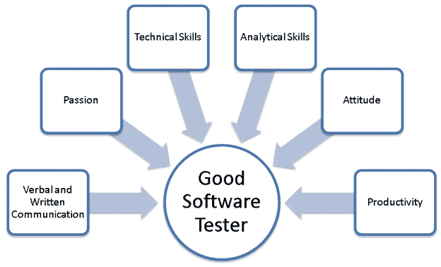
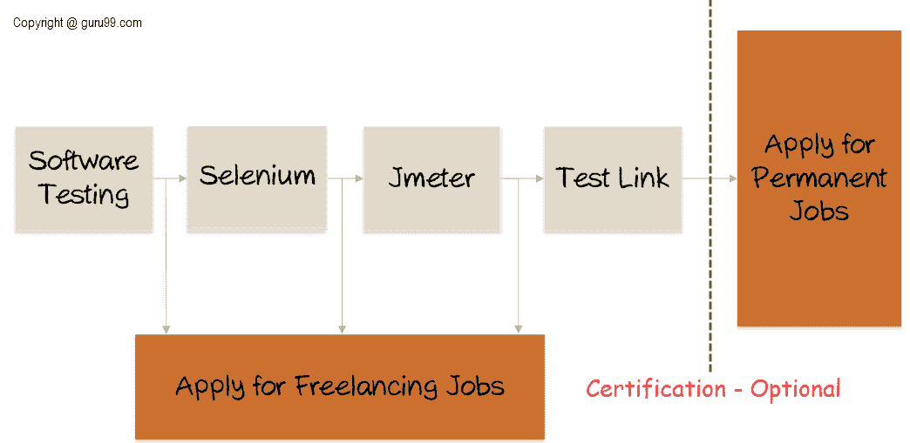

# 软件测试作为职业道路（技能，薪水，成长）

> 原文： [https://www.guru99.com/software-testing-career-complete-guide.html](https://www.guru99.com/software-testing-career-complete-guide.html)

本指南将指导您完成软件测试的内容。 如果您打算从事软件测试工作，这是必读！

## 什么是软件测试？

软件测试是验证计算机系统/程序以确定其是否符合指定要求并产生所需结果的过程。 结果，您可以确定软件产品/项目中的错误。

软件测试对于提供高质量的产品而没有任何错误或问题必不可少。

在本教程中，您将学习-

*   [什么是软件测试？](#1)
*   [成为软件测试人员所需的技能](#2)

*   [非技术技能](#3)
*   [技术技能](#4)
*   [学术背景](#5)
*   [薪酬](#6)
*   [软件测试员做什么？](#7)
*   [软件测试员职业路径](#8)
*   [作为软件测试人员的替代职业](#9)
*   [常见神话](#10)

*   [如何成为软件测试员](#11)
*   [认证考试：](#12)

## 成为软件测试员所需的技能

我们将讨论成为软件测试员所需的技术和非技术

### 非技术技能

跟随技能对于成为一名优秀的软件测试员至关重要。 将您的技能与以下清单进行比较，以确定软件测试是否对您来说是现实的-

*   **分析技能**：一个好的软件测试人员应该具有敏锐的分析技能。 分析技能将有助于将复杂的软件系统分解为较小的单元，以更好地理解并创建测试用例。 不确定您是否具有良好的分析能力-请参考[链接](http://www.folj.com/puzzles/)-如果您至少可以解决一个问题，那么您具有出色的分析能力。
*   **沟通技巧**：好的软件测试人员必须具有良好的口头和书面沟通能力。 软件测试人员创建的测试工件（如测试用例/计划，测试策略，错误报告等）应易于阅读和理解。 与开发人员打交道（如果发生错误或任何其他问题）将需要谨慎和外交。
*   **时间管理&组织技能：**有时测试可能是一项艰巨的工作，尤其是在代码发布期间。 软件测试人员必须有效地管理工作负载，具有高生产率，展现出最佳的时间管理和组织技能
*   **很好的态度：**要成为一个好的软件测试人员，您必须有一个很好的态度。 对“测试断裂”的态度，注重细节，愿意学习并提出改进建议。 在软件行业中，技术飞速发展，一个优秀的软件测试人员应该通过不断变化的技术来提升其技术能力。 您的态度必须反映出一定程度的独立性，您可以掌控分配的任务并在没有太多直接监督的情况下完成任务。
*   **Passion:** To Excel in any profession or job, one must have a significant degree of the passion for it. A software tester must have a passion for his / her field. BUT how do you determine whether you have a passion for software testing if you have never tested before? Simple TRY it out and if software testing does not excite you switch to something else that holds your interest.

    

### 技术技能

此列表很长，请耐心等待

*   **数据库/ SQL 的基本知识：**软件系统在后台有大量数据。 这些数据存储在后端的不同类型的数据库中，例如 Oracle，MySQL 等。 因此，在某些情况下需要验证此数据。 在那种情况下，简单/复杂 [SQL](/sql.html) 查询可用于检查后端数据库中是否存储了正确的数据。
*   **Linux 命令的基本知识：**大多数软件应用程序（例如 Web 服务，数据库，应用程序服务器）都部署在 Linux 机器上。因此，测试人员必须了解 [Linux 命令](/unix-linux-tutorial.html)，这一点至关重要 。
*   **Knowledge and hands-on experience of a Test Management Tool:**[Test Management](/test-management.html) is an important aspect of Software testing. Without proper test management techniques, software testing process will fail. Test management is nothing but managing your testing related artifacts.

    例如-诸如 [Testlink](/testlink-tutorial-complete-guide.html) 之类的工具可用于跟踪团队编写的所有测试用例。

    还有其他可用的工具可用于测试管理。 因此，拥有此类工具的知识和工作经验很重要，因为大多数公司都使用这些工具。

*   **任何缺陷跟踪工具的知识和实践经验-**缺陷跟踪和[缺陷生命周期](/defect-life-cycle.html)是软件测试的关键方面。 正确管理缺陷并以系统的方式跟踪缺陷是至关重要的。 由于整个团队应了解缺陷，包括经理，开发人员和测试人员，因此必须进行缺陷跟踪。 几种工具用于锁定缺陷，包括 [QC](/hp-alm-free-tutorial.html) ， [Bugzilla](/bugzilla-tutorial-for-beginners.html) ， [Jira](/jira-tutorial-a-complete-guide-for-beginners.html) 等。
*   **Knowledge and hands-on experience of Automation tool:** If you see yourself as an "Automation tester" after a couple of years working on manual testing, then you must master a tool and get in-depth, hands-on knowledge of automation tools.

    **注意**-仅对任何自动化工具的知识不足以破解面试，您必须具有良好的动手经验，因此请练习自己选择的工具以达到精通的目的。 如果您正在寻找自动化工作，那么对任何脚本语言（例如 VBScript， [JavaScript](/interactive-javascript-tutorials.html) 和 [C＃](/c-sharp-tutorial.html)）的了解都将对测试人员有所帮助。 很少有公司也使用 Shell / [Perl](/perl-tutorials.html) 脚本，并且对具有相同知识的测试人员有很多需求。 同样，这将取决于公司以及该公司使用的工具。

[性能测试](/performance-testing.html)工具还有很多范围，因为需要对应用程序的性能进行测试，这是非功能测试的一部分。

技术知识就是这样。 请注意，您不需要上面列出的所有技术技能。 所需的技术技能因职位和公司流程而异。

### 学术背景

软件测试人员的学术背景应为计算机科学。

BTech / B.E.，MCA，BCA，BSc 计算机将使您迅速找到工作。

如果您没有这些学位，则必须完成软件测试认证，例如 [ISTQB](/istqb.html) 和 [CSTE](/qai-cste-guide-exam-pattern.html) ，可帮助您学习软件开发/测试生命周期和其他测试方法。

### 薪酬

一家公司的软件测试人员的薪酬各不相同。 在美国，软件测试人员的平均薪资范围为$ 45,993-$ 74,935。 印度软件测试人员的平均薪资范围为 247,315 卢比-449,111 卢比。

此外，软件测试人员还将获得健康保险，奖金，酬金和其他津贴。

### 软件测试器做什么？

在任何典型的工作日中，您将忙于了解需求文档，创建测试案例，执行测试案例，报告和重新测试错误，参加审查会议以及其他团队建设活动。

### 软件测试员职业路径

在典型的 CMMI 5 级公司中，您作为软件测试员（QA Analyst）的职业发展将遵循以下步骤，但因公司而异

1.  质量检查分析师（新鲜人）
2.  高级质量检查分析师（2-3 年经验）
3.  质量检查团队协调员（5-6 年的经验）
4.  测试经理（8-11 年经验）
5.  高级测试经理（14 岁以上经验）

### 作为软件测试员的替代职业轨道

一旦手动测试变得肮脏，就可以继续从事以下专业

*   **自动化测试**：作为自动化测试工程师，您将负责自动化手动执行测试用例，否则可能会很费时。 使用的工具 IBM Rational Robot，Silk Performer 和 QTP
*   **性能测试：**作为性能测试工程师，您将负责检查应用程序的响应性（加载时间，应用程序可以处理的最大负载）等。工具使用了 WEBLoad，Loadrunner。
*   **业务分析师**：测试人员相对于开发人员的主要优势是他们拥有端到端的业务知识。 对于测试人员而言，明显的职业发展是成为一名业务分析师。 作为[业务分析师](/business-analyst-tutorial-course.html)，您将负责分析和评估公司的业务模型和工作流程。 作为学士学位，您将把这些模型和工作流程与技术集成在一起。

### 常见神话

与职业测试人员相比，软件职业测试花费更少开发人员更受尊重

与普遍的看法相反，软件测试人员（更名为 QA 专业人员）的报酬和待遇与所有“有抱负”公司的软件开发人员同等。 软件测试的职业永远不应被视为“第二等级”。

软件测试很无聊

软件测试实际上可以“测试”您的神经，因为您需要了解业务需求并根据您的理解起草测试用例。 软件测试并不乏味。 无聊的是重复执行相同的任务集。 关键是尝试新事物。 因此，您是否曾与拥有 3 年以上经验的软件开发人员交谈过？ 他会告诉你，他的工作变得很无聊了。

## 如何成为软件测试员

对于新手来说，这是我们建议的学习软件测试的方法

您从学习软件测试的基本原理开始。 完成后，您**申请自由职业。 这将帮助您获得实践知识，并巩固您所学的测试概念。**

接下来，继续使用 Selenium-自动化工具，然后是 JMeter-性能测试工具，最后是 TestLink-测试管理工具。 在学习的过程中，我们建议您申请自由职业（除了其他好处，您也将蒙受损失！）。

使用完所有工具后，您可以考虑参加认证。 我们建议使用 ISTQB。 但是，这是可选的。

## 认证考试：

ISTQB 基础级别是“测试”领域的基本认证。

这不是强制性的，但是它将帮助您增加获得工作的机会。 大多数公司都有这个标准。

与其他软件测试仪相比，清除了 ISTQB 的软件测试仪将具有更高的优先级。

此后，当您在大公司申请永久性工作时，您将具有许多技能，可以提供一些实用的自由职业经验，这些经验可能有价值，并会增加被选中的机会。

您也可以在您选择的测试工具中寻求认证。

**学习指南：-**

*   软件测试教程-[链接](/software-testing.html)
*   硒-[链接](/selenium-tutorial.html)或者，您也可以学习 [QTP](/quick-test-professional-qtp-tutorial.html)
*   Jmeter-[链接](/jmeter-tutorials.html)或者，您也可以学习 [Loadrunner](/loadrunner-v12-tutorials.html)
*   Testlink-[链接](/testlink-tutorial-complete-guide.html)或者，您也可以学习[质量中心](/hp-alm-free-tutorial.html)
*   自由职业– [UpWork](https://www.upwork.com/) 或 [Freelancer](https://www.freelancer.com/)
*   永久性工作-任何主要的工作门户网站，例如 monster.com 或 naukri.com

希望有一天能在质量检查会议上见到您！ :-)

这是一个可以帮助您做出职业选择的工具