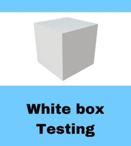

# 什么是白盒测试？ 技术，示例，类型&工具

> 原文： [https://www.guru99.com/white-box-testing.html](https://www.guru99.com/white-box-testing.html)

## 什么是白盒测试？

**白盒测试**正在测试软件解决方案的内部结构，设计和编码。 它也称为透明箱测试，开箱测试，结构测试，透明箱测试，基于代码的测试和玻璃箱测试。 它通常由开发人员执行。

在这种类型的测试中，测试人员可以看到该代码。 它主要侧重于验证通过应用程序的输入和输出流，改善设计和可用性，增强安全性。

它是**盒测试**方法进行软件测试的两个部分之一。 其对应的**黑盒测试**涉及从外部或最终用户类型的角度进行测试。 另一方面，Whitebox 测试基于应用程序的内部工作原理，并围绕内部测试展开。

因为透明框的概念，所以使用了“ WhiteBox”一词。 透明框或 WhiteBox 名称象征着能够查看软件外壳（或“框”）进入其内部功能的能力。 同样，“ [黑盒测试](/black-box-testing.html)”中的“黑盒”表示无法看到软件的内部工作原理，因此只能测试最终用户的体验。

在本教程中，您将学习-

*   [什么是白盒测试？](#1)
*   [您在白盒测试中验证了什么？](#2)
*   [您如何执行白盒测试？](#3)
*   [白盒测试示例](#4)
*   [白盒测试技术](#5)
*   [白盒测试的类型](#6)
*   [白盒测试工具](#9)
*   [白盒测试的优势](#7)
*   [白盒测试的缺点](#8)

## 您在白盒测试中验证了什么？

白盒测试涉及以下软件代码的测试：

*   内部安全漏洞
*   编码过程中路径损坏或结构不良
*   通过代码的特定输入流
*   预期产量
*   条件循环的功能
*   分别测试每个语句，对象和功能

测试可以在软件开发的系统，集成和单元级别进行。 白盒测试的基本目标之一是验证应用程序的工作流程。 它涉及针对预期或期望的输出测试一系列预定义的输入，以便当特定输入未产生预期的输出时，您会遇到错误。

## 您如何执行白盒测试？

为了简化白盒测试的解释，我们将其分为**两个基本步骤**。 这是测试人员使用白盒测试技术测试应用程序时所做的事情：

第 1 步）了解源代码

测试人员经常要做的第一件事是学习和理解应用程序的源代码。 由于白盒测试涉及对应用程序内部工作的测试，因此测试人员必须非常了解所测试应用程序中使用的编程语言。 另外，测试人员必须高度了解安全的编码做法。 安全通常是测试软件的主要目标之一。 测试人员应该能够发现安全问题，并防止黑客和幼稚用户的攻击，他们可能有意或无意将恶意代码注入应用程序。

**步骤 2）创建测试案例并执行**

白盒测试的第二个基本步骤涉及测试应用程序的源代码，以获取正确的流程和结构。 一种方法是编写更多代码以测试应用程序的源代码。 测试人员将为应用程序中的每个过程或一系列过程开发很少的测试。 此方法要求测试人员必须对代码有深入的了解，并且通常由开发人员完成。 其他方法包括[手动测试](/manual-testing.html)，试用和错误测试，以及测试工具的使用，我们将在本文中进一步进行解释。

<center></center>

## 白盒测试示例

考虑以下代码

```
Printme (int a, int b) {                       ------------  Printme is a function 
    int result = a+ b; 
    If (result> 0)
    	Print ("Positive", result)
    Else
    	Print ("Negative", result)
    }                                        -----------   End of the source code 
```

软件工程中 WhiteBox 测试的目标是验证代码中的所有决策分支，循环，语句。

为了执行上述代码中的语句，WhiteBox 测试用例应为

*   A = 1，B = 1
*   A = -1，B = -3

## 白盒测试技术

白盒测试的主要技术是代码覆盖率分析。 代码覆盖率分析消除了[测试用例](/test-case.html)套件中的空白。 它标识一组测试用例未执行的程序区域。 一旦发现差距，就可以创建测试用例来验证未经测试的代码部分，从而提高软件产品的质量。

有自动工具可以执行代码覆盖率分析。 以下是箱式测试仪可以使用的几种覆盖率分析技术：

**语句覆盖率**：-此技术要求在软件工程的测试过程中，至少对代码中的所有可能语句进行一次测试。

**分支覆盖范围-**该技术检查软件应用程序的每个可能路径（if-else 和其他条件循环）。

除了上述内容外，还有许多覆盖类型，例如条件覆盖，多个条件覆盖，路径覆盖，功能覆盖等。每种技术都有其自身的优点，并尝试测试（覆盖）软件代码的所有部分。 **使用语句和分支覆盖率，通常可以达到 80-90％的代码覆盖率。**

Following are important WhiteBox Testing Techniques:

*   声明范围
*   决策范围
*   分行覆盖
*   条件覆盖
*   多条件覆盖
*   有限状态机覆盖率
*   路径覆盖
*   控制流测试
*   数据流测试

请参阅本文以了解更多详细信息。 [https://www.guru99.com/code-coverage.html](/code-coverage.html)

## 白盒测试的类型

*白盒测试*包含几种用于评估应用程序，代码块或特定软件包的可用性的测试类型。 以下列出-

*   **单元测试：**通常是在应用程序上进行的第一类测试。 [单元测试](/unit-testing-guide.html)在开发的每个单元或代码块上执行。 单元测试本质上是由程序员完成的。 作为软件开发人员，您需要开发几行代码，单个函数或对象，并对其进行测试，以确保其能够正常工作，然后再继续进行单元测试，以帮助在软件开发生命周期的早期识别出大多数错误。 在此阶段发现的错误更便宜且易于修复。

*   **测试内存泄漏**：内存泄漏是导致应用程序运行缓慢的主要原因。 在您的软件应用程序运行缓慢的情况下，具有检测内存泄漏经验的质量检查专家至关重要。

除上述之外，黑盒和白盒测试均包含一些测试类型。 它们列出如下

*   **白盒[渗透测试](/learn-penetration-testing.html)：**在此测试中，测试人员/开发人员具有应用程序源代码的完整信息，详细的网络信息，涉及的 IP 地址以及应用程序在其上运行的所有服务器信息。 目的是从多个角度攻击代码以暴露安全威胁
*   **白盒突变测试**：突变测试通常用于发现用于扩展软件解决方案的最佳编码技术。

## 白盒测试工具

以下是顶级白盒测试工具的列表。

*   [Parasoft Jtest](http://bit.ly/2V8ypxo)
*   [EclEmma](https://www.eclemma.org/download.html)
*   [NUnit](http://nunit.org/)
*   [PyUnit](https://www.guru99.com/python-unit-testing-guide.html)
*   [HTMLUnit](http://htmlunit.sourceforge.net/)
*   [CppUnit](https://sourceforge.net/projects/cppunit/)

## 白盒测试的优势

*   通过发现隐藏的错误进行代码优化。
*   白盒测试用例可以轻松实现自动化。
*   由于通常涵盖所有代码路径，因此测试更加彻底。
*   即使没有 GUI，也可以在 SDLC 中尽早开始测试。

## 白盒测试的缺点

*   白盒测试可能非常复杂且昂贵。
*   通常执行白盒测试用例的开发人员会讨厌它。 开发人员未对白盒进行详细测试会导致生产错误。
*   白盒测试需要专业资源，并且对编程和实现有详细的了解。
*   白盒测试非常耗时，较大的编程应用程序需要花费大量时间才能进行全面测试。

**尾注：**

*   白盒测试可能非常复杂。 涉及的复杂性与要测试的应用程序有很大关系。 一个执行单个简单操作的小型应用程序可以在几分钟内进行白盒测试，而大型编程应用程序则需要数天，数周甚至更长的时间才能完全测试。
*   软件测试中的白盒测试应在编写软件应用程序时进行，因为它是在编写之后以及每次修改后都要开发的