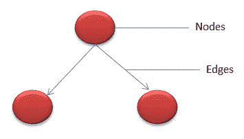
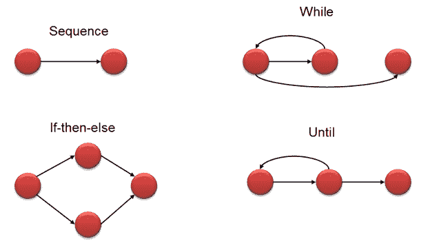
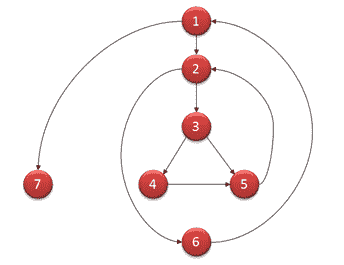

# Mccabe 的环复杂性：使用流程图进行计算（示例）

> 原文： [https://www.guru99.com/cyclomatic-complexity.html](https://www.guru99.com/cyclomatic-complexity.html)

要了解环复杂性，首先要了解-

### 什么是软件指标？

测量不过是产品/过程属性的大小/尺寸/容量的定量指示。 软件度量标准被定义为软件系统在成本，质量，规模和进度方面具有的属性的定量度量。

**范例-**

```
Measure - No. of Errors
Metrics - No. of Errors found per person
```

在本教程中，您将学习-

*   [什么是软件指标？](#1)
*   [什么是环复杂性？](#2)
*   [程序的流程图符号：](#3)
*   [如何计算环复杂度](#4)
*   [圈复杂度的属性：](#5)
*   [此指标对软件测试有何用处？](#6)
*   [有关 V（G）的更多信息：](#7)
*   [环复杂度计算工具：](#8)
*   [环复杂性的用途：](#9)

## 什么是环复杂性？

**循环复杂度**是一种用于度量程序复杂度的软件度量。 它是程序源代码中独立路径的定量度量。 独立路径被定义为具有至少一个在其他任何路径中从未被遍历过的边缘的路径。 可以相对于程序中的功能，模块，方法或类来计算圈复杂度。

该度量标准是由 Thomas J. McCabe 在 1976 年开发的，它基于程序的控制流表示形式。 控制流将程序描述为一个由节点和边组成的图形。

在图中，节点表示处理任务，而边缘表示节点之间的控制流。

**** 

## 程序的流程图符号：

程序的流程图表示法定义了通过边连接的几个节点。 下面是语句的流程图，如 if-else，While，直到和正常顺序。

.png)

## 如何计算环复杂度

**数学表示形式：**

在数学上，它是通过图形图的一组独立路径。 可以使用以下公式定义程序的代码复杂度-

```
V(G) = E - N + 2
```

哪里，

E-边数

N-节点数

```
V (G) = P + 1
```

其中 P =谓词节点数（包含条件的节点）

范例-

```
i = 0;
n=4; //N-Number of nodes present in the graph

while (i<n-1) do
j = i + 1;

while (j<n) do

if A[i]<A[j] then
swap(A[i], A[j]);

end do;
i=i+1;

end do;
```

该程序的流程图将是

.png)

**数学计算，**

*   V（G）= 9-7 + 2 = 4
*   V（G）= 3 +1 = 4（条件节点是 1,2 和 3 个节点）
*   基础集-程序的可能执行路径的集合
*   1, 7
*   1, 2, 6, 1, 7
*   1, 2, 3, 4, 5, 2, 6, 1, 7
*   1, 2, 3, 5, 2, 6, 1, 7

## 圈复杂度的属性：

以下是圈复杂度的属性：

1.  V（G）是图中独立路径的最大数量
2.  V（G）> = 1
3.  如果 V（G）= 1，则 G 将具有一条路径
4.  将复杂度降至 10

## 此指标对软件测试有何用处？

基础路径测试是白盒技术之一，它保证在测试过程中至少执行一条语句。 它检查通过程序的每条线性独立路径，这意味着**意味着数量测试用例，将等同于程序的循环复杂性。**

由于圈复杂度（M）的属性，此指标非常有用-

1.  M 可以是达到分支覆盖率的测试用例数（上限）
2.  M 可以是通过图形的路径数。 （下界）

考虑这个例子-

```
If (Condition 1)
Statement 1

Else
Statement 2

If (Condition 2)
Statement 3

Else
Statement 4
```

该程序的循环复杂度为 8-7 + 2 = 3。

由于计算的复杂度为 3，因此上述示例的完整路径覆盖范围需要三个测试用例。

## 应遵循的步骤：

计算环复杂度和测试用例设计时，应遵循以下步骤。

**步骤 1** -通过代码构造带有节点和边的图

**步骤 2** -标识独立路径

**步骤 3** -循环复杂度计算

**步骤 4** -测试用例的设计

一旦基本集形成，应编写测试案例以执行所有路径。

## 有关 V（G）的更多信息：

如果程序较小，则可以手动计算圈复杂度。 如果程序非常复杂，则需要使用自动化工具，因为这涉及更多流程图。 基于复杂度数字，团队可以得出需要采取措施的措施的结论。

下表概述了 v（G）的复杂度数和相应含义：

| **复杂度编号** | **含义** |
| 1-10 | 结构化且编写良好的代码

高可测试性

成本和工作量更少 |
| 10-20 | 复杂代码

可测试性

成本和工作量中等 |
| 20-40 | 非常复杂的代码

低可测试性

成本和精力都很高 |
| > 40 | 根本无法测试

很高的成本和工作量 |

## 环复杂度计算工具：

许多工具可用于确定应用程序的复杂性。 一些复杂度计算工具用于特定技术。 复杂度可以通过程序中决策点的数量来确定。 决策点是源代码中的 for，for，for，while，do，catch 语句。

工具的示例是

*   [OCLint](https://github.com/oclint/oclint "OCLint") -用于 C 和相关语言的静态代码分析器
*   .NET 程序集的反射器添加代码内度量
*   [GMetrics](https://github.com/dx42/gmetrics "GMetrics") -在 [Java](/java-tutorial.html) 相关应用程序中查找指标

## 环复杂性的用途：

圈复杂度可以证明在以下方面非常有帮助

*   帮助开发人员和测试人员确定独立的路径执行
*   开发人员可以确保所有路径都至少经过了一次测试
*   帮助我们将重点更多地放在未发现的路径上
*   提高软件工程中的代码覆盖率
*   评估与应用程序或程序相关的风险
*   在周期的早期使用这些指标可以降低程序的更多风险

### 结论：

Cyclomatic Complexity 是用于结构化或[白盒测试](/white-box-testing.html)的软件度量。 它主要用于评估程序的复杂性。 如果决策点更多，那么程序的复杂性就会更多。 如果程序具有较高的复杂度数，则错误的可能性会很高，从而增加维护和故障排除的时间。