# 代码覆盖率教程：分支，语句，决策，FSM

> 原文： [https://www.guru99.com/code-coverage.html](https://www.guru99.com/code-coverage.html)

## 什么是代码覆盖率？

代码覆盖率是一种度量，它描述了对程序源代码进行测试的程度。 这是白盒测试的一种形式，它可以找到一组测试用例无法执行的程序区域。 它还创建一些测试用例以增加覆盖范围并确定代码覆盖范围的定量度量。

在大多数情况下，代码覆盖系统会收集有关正在运行的程序的信息。 它还将其与源代码信息相结合，以生成有关测试套件的代码覆盖率的报告。

在本教程中，您将学习-

*   [什么是代码覆盖率？](#1)
*   [为什么使用代码覆盖率？](#2)
*   [代码覆盖率方法](#3)
*   [声明涵盖范围](#4)
*   [决策范围](#5)
*   [分支机构覆盖范围](#6)
*   [条件覆盖范围](#7)
*   [有限状态机覆盖率](#8)
*   [选择哪种类型的代码覆盖率](#9)
*   [代码覆盖率与功能覆盖率](#10)
*   [代码覆盖率工具](#11)
*   [使用代码覆盖率的优缺点](#12)

## 为什么使用代码覆盖率？

以下是使用代码覆盖率的一些主要原因：

*   它可以帮助您评估测试实施的效率
*   它提供定量测量。
*   它定义了对源代码进行测试的程度。

## 代码覆盖率方法

以下是主要的代码覆盖方法

*   声明范围
*   决策范围
*   分行覆盖
*   切换覆盖
*   FSM 覆盖

## 声明覆盖率

什么是对帐单覆盖？

语句覆盖是一种白盒测试设计技术，涉及到至少一次执行源代码中的所有可执行语句。 它用于计算和测量源代码中可以根据要求执行的语句数。

语句覆盖率用于根据测试代码的结构派生方案。

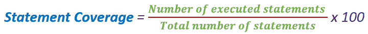

在[白盒测试](/white-box-testing.html)中，测试人员专注于软件的工作方式。 换句话说，测试人员将专注于与控制流程图或流程图有关的源代码的内部工作。

通常，在任何软件中，如果我们查看源代码，都会有各种各样的元素，例如运算符，函数，循环，异常处理程序等。根据程序的输入，某些代码语句可能不会执行 。 覆盖 Statement 的目标是覆盖代码中所有可能的路径，行和语句。

让我们通过一个示例来了解这一点，该示例如何计算语句覆盖率。

计算给定源代码的语句覆盖率的方案。 在这里，我们采用两种不同的方案来检查每种方案的语句覆盖率。

**源代码：**

```
Prints (int a, int b) {                       ------------  Printsum is a function 
    int result = a+ b; 
    If (result> 0)
    	Print ("Positive", result)
    Else
    	Print ("Negative", result)
    }                                        -----------   End of the source code 

```

**方案 1：**

如果 A = 3，B = 9

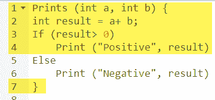

黄色标记的语句是根据业务情景执行的语句

执行语句数= 5，语句总数= 7

声明覆盖率：5/7 = 71％

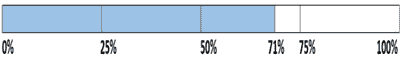

同样，我们将看到场景 2，

**方案 2：**

如果 A = -3，B = -9

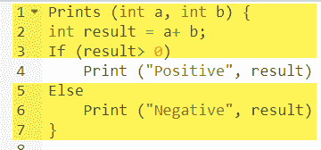

黄色标记的语句是根据方案执行的语句。

执行语句数= 6

语句总数= 7

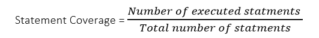

声明覆盖率：6/7 = 85％

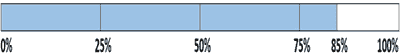

但是总的来说，如果您看到的话，所有的陈述都将被考虑在 2 <sup>和</sup>场景中。 因此，我们可以得出结论，整个报表覆盖率为 100％。

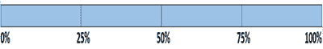

**声明涵盖范围是什么？**

1.  未使用的陈述
2.  死码
3.  未使用的分支
4.  遗失陈述

## 决策范围

决策覆盖率报告每个布尔表达式的正确或错误结果。 在这种情况下，表达式有时会变得复杂。 因此，很难实现 100％的覆盖率。

这就是为什么有许多不同的方法来报告此指标的原因。 所有这些方法都专注于涵盖最重要的组合。 它与决策覆盖率非常相似，但是对控制流的敏感性更高。

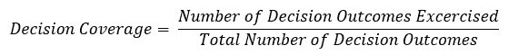

### 决策范围示例

考虑以下代码-

```
Demo(int a) {                       
     If (a> 5)
    	a=a*3
     Print (a)
    }

```

**Scenario 1:**

a 的值为 2

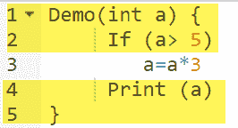

以黄色突出显示的代码将被执行。 在此，检查判定 If（> 5）的“否”结果。

决策覆盖率= 50％

**Scenario 2:**

a 的值为 6

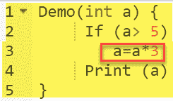

以黄色突出显示的代码将被执行。 在此，检查判定 If（“ > 5”）的“是”结果。

Decision Coverage = 50%

| 测试用例 | A 值 | 输出量 | 决策范围 |
| 1 | 2 | 2 | 50% |
| 2 | 6 | 18 | 50% |

## 分支机构覆盖率

在分支机构范围内，将测试代码模块的所有结果。 例如，如果结果是二进制的，则需要同时测试 True 和 False 结果。

它可以帮助您确保至少一次执行每个决策条件的每个可能分支。

通过使用分支覆盖率方法，您还可以测量独立代码段的分数。 它还可以帮助您找出哪些代码段没有分支。

计算分支覆盖率的公式：

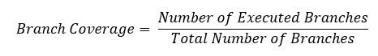

### 分支机构覆盖示例

要了解分支机构的覆盖范围，让我们考虑先前使用的相同示例

考虑以下代码

```
Demo(int a) {                       
     If (a> 5)
    	a=a*3
     Print (a)
    }                                       

```

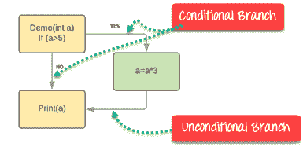

分支机构覆盖范围也将考虑无条件分支

| Test Case | Value of A | Output | Decision Coverage | 分行覆盖 |
| 1 | 2 | 2 | 50% | **33％** |
| 2 | 6 | 18 | 50% | **67％** |

**分支机构覆盖范围的优势：**

分支机构覆盖测试具有以下优点：

*   允许您验证-代码中的所有分支
*   帮助您确保没有分支导致程序运行的任何异常
*   分支覆盖方法可消除由于语句覆盖测试而发生的问题
*   Allows you to find those areas which are not tested by other testing methods
*   它使您可以找到量化的代码覆盖率度量
*   分支覆盖范围会忽略布尔表达式内部的分支

## 条件覆盖

条件覆盖率或表达式覆盖率将揭示如何评估条件语句中的变量或子表达式。 在这种情况下，仅考虑具有逻辑操作数的表达式。

例如，如果表达式具有布尔运算（例如 AND，OR，XOR），则表示存在全部可能性。

与决策范围相比，条件范围对控制流的敏感性更高。 条件覆盖并不能保证完整的决策覆盖范围

计算条件覆盖率的公式：

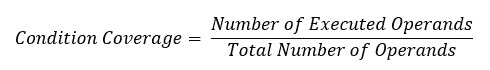

例：

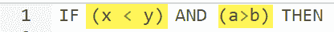

对于上面的表达式，我们有 4 种可能的组合

*   TT
*   FF
*   TF
*   金融时报

考虑以下输入

| X = 3Y = 4 | （x < y） | 真正 | 条件覆盖率为¼= 25％ |
| A = 3B = 4 | （a > b） | 假 |

## 有限状态机覆盖率

有限状态机的覆盖率无疑是最复杂的代码覆盖方法。 这是因为它可以处理设计的行为。 在这种覆盖方法中，您需要查找已访问，转换的特定时间状态的数量。 它还检查有限状态机中包含多少个序列。

## 选择哪种类型的代码覆盖率

这无疑是最难给出的答案。 为了选择一种覆盖方法，测试人员需要检查

*   被测代码具有单个或多个未发现的缺陷
*   潜在罚款的成本
*   丧失声誉的代价
*   销售损失成本等

缺陷导致高成本生产故障的可能性越高，则需要选择的覆盖级别越严格。

## 代码覆盖率与功能覆盖率

| **代码覆盖率** | **功能范围** |
| 代码覆盖率告诉您测试平台对源代码的执行情况。 | 功能覆盖范围衡量测试平台对设计功能的覆盖程度。 |
| 切勿使用设计规范 | 使用设计规范 |
| 由开发人员完成 | 由测试人员完成 |

## 代码覆盖率工具

以下是重要的代码覆盖率工具列表：

| **工具名称** | **说明** |
| **[可可](https://bit.ly/2FLrNAS)** | 它是针对 C，C ++，SystemC，C＃，Tcl 和 QML 代码的跨平台和跨编译器的代码覆盖率分析。 自动测量语句，分支和条件的测试覆盖率。 无需更改应用程序。了解有关 [coco](https://bit.ly/2FLrNAS) 的更多信息 |
| **覆盖范围** | 它是一个开源代码覆盖工具。 它通过检测代码库来度量测试覆盖率，并分析测试套件运行时正在执行的代码行和未执行的代码行。 |
| **三叶草** | Clover 还通过仅运行覆盖自上次构建以来已修改的应用程序代码的测试来减少测试时间。 |
| **DevPartner** | DevPartner 使开发人员能够分析 Java 代码的代码质量和复杂性。 |
| **艾玛** | EMMA 支持类，方法，行和基本块覆盖范围，聚合的源文件，类和方法级别。 |
| **Kalistick** | Kalistick 是第三方应用程序，它以不同的角度分析代码。 |
| **CoView 和 CoAnt** | 编码软件是用于度量标准，模拟对象创建，代码可测试性，路径&分支覆盖率等的代码覆盖率工具。 |
| **适用于 C ++的 Bullseye** | BulseyeCoverage 是 C ++和 C 的代码覆盖工具。 |
| **声纳** | Sonar 是一个开放的代码覆盖率工具，可以帮助您管理代码质量。 |

## 使用代码覆盖率的优势

*   有助于评估量化的代码覆盖率
*   它允许您创建额外的测试用例以增加覆盖范围
*   它使您能够找到程序集中未使用的测试用例的区域

## 使用代码覆盖率的缺点

*   即使在设计中未实现任何特定功能，代码覆盖率仍然报告为 100％覆盖率。
*   无法确定是否在代码覆盖率的帮助下测试了功能的所有可能值
*   代码覆盖率也没有告诉您覆盖逻辑的程度和程度
*   如果指定的功能尚未实现或未包含在规范中，则基于结构的技术将找不到该问题。

## 摘要

*   代码覆盖率是一种度量，它描述了对程序源代码进行了测试的程度
*   它可以帮助您评估测试实施的效率
*   五种代码覆盖率方法是 1.）语句覆盖率 2.）条件覆盖率 3）分支覆盖率 4）切换覆盖率 5）FSM 覆盖率
*   语句覆盖涉及至少一次执行源代码中的所有可执行语句
*   决策覆盖率报告每个布尔表达式的正确或错误结果
*   在分支机构中，将测试代码模块的所有结果
*   条件语句将揭示如何评估条件语句中的变量或子表达式
*   有限状态机覆盖率无疑是最复杂的代码覆盖率类型
*   为了选择一种覆盖方法，测试人员需要检查潜在罚款的成本，声誉损失，销售损失等。
*   代码覆盖率告诉您测试平台对源代码的执行情况，而功能覆盖率则衡量设计功能被覆盖的程度
*   Cobertura，JTest，Clover，Emma 和 Kalistick 是一些重要的代码覆盖工具
*   代码覆盖率使您可以创建额外的测试用例以增加覆盖率
*   代码覆盖率无法帮助您确定我们是否测试了功能的所有可能值