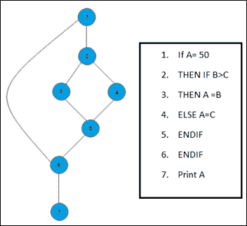

# 路径测试&包含示例的基础路径测试

> 原文： [https://www.guru99.com/basis-path-testing.html](https://www.guru99.com/basis-path-testing.html)

### 什么是路径测试？

路径测试是一种结构测试方法，涉及使用程序的源代码来查找每个可能的可执行路径。 它有助于确定代码段中的所有故障。 此方法旨在通过计算机程序执行所有或选定的路径。

任何软件程序都包含多个入口和出口点。 测试所有这些点既具有挑战性又耗时。 为了减少冗余测试并实现最大的测试覆盖率，使用了基本路径测试。

## 什么是基础路径测试？

基本路径测试是相同的，但是它基于[白盒测试](/white-box-testing.html)方法，该方法基于可通过程序采用的流或逻辑路径定义测试用例。 在软件工程中，基础路径测试包括执行程序中所有可能的块，并以最少的测试用例获得最大的路径覆盖率。 它是分支测试和路径测试方法的混合。

软件测试中基本路径的目的在于定义独立路径的数量，因此可以明确定义所需的测试用例的数量（最大程度地覆盖每个测试用例的覆盖范围）。

在这里，我们将举一个简单的例子，以更好地了解什么是基本路径测试，包括

在上面的示例中，我们可以看到根据条件满足的条件语句很少。 这里有 3 条路径或条件需要进行测试才能获得输出，

*   **路径 1** ：1、2、3、5、6、7
*   **路径 2** ：1、2、4、5、6、7
*   **路径 3** ：1、6、7

## 基础路径测试的步骤

基本路径测试涉及的基本步骤包括

*   绘制控制图（以确定不同的程序路径）
*   计算[循环复杂度](/cyclomatic-complexity.html)（用于确定独立路径数的度量）
*   找到一组基本路径
*   生成测试用例以练习每条路径

## 基本路径测试的优势

*   它有助于减少冗余测试
*   它着重于程序逻辑
*   它有助于简化分析和任意案例设计
*   具有练习基础集的测试用例将至少执行一次程序中的每个语句

**结论：**

基础路径测试有助于确定代码段中的所有故障。