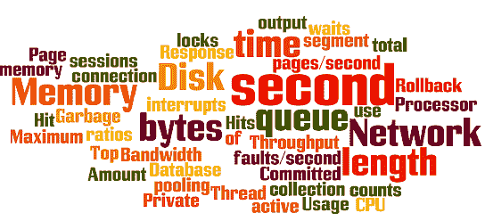

# 性能测试教程：什么是类型，度量&示例

> 原文： [https://www.guru99.com/performance-testing.html](https://www.guru99.com/performance-testing.html)

## 什么是性能测试？

**性能测试**检查软件程序在预期负载下的速度，响应时间，可靠性，资源使用率，可伸缩性。 性能测试的目的不是发现功能缺陷，而是消除软件或设备中的性能瓶颈。

性能测试的重点是检查软件程序的

*   速度-确定应用程序是否快速响应
*   可伸缩性-确定软件应用程序可以处理的最大用户负载。
*   稳定性-确定应用程序在各种负载下是否稳定

性能测试通常被称为“性能测试”，是性能工程的一部分。

在本教程中，您将学习-

*   [什么是性能测试？](#1)
*   [为什么要进行性能测试？](#2)
*   [性能测试的类型](#3)
*   [常见的性能问题](#4)
*   [性能测试流程](#5)
*   [性能测试指标：受监视的参数](#6)
*   [性能测试案例](#7)
*   [性能测试工具](#8)
*   [常见问题解答](#9)

## 为什么要进行性能测试？

软件系统支持的特性和功能不是唯一的问题。 软件应用程序的性能（如响应时间，可靠性，资源使用率和可伸缩性）至关重要。 性能测试的目的不是发现错误，而是消除性能瓶颈。

进行性能测试是为了向涉众提供有关其应用程序的有关速度，稳定性和可伸缩性的信息。 更重要的是，性能测试发现了产品上市之前需要改进的地方。 如果没有性能测试，软件可能会遇到以下问题：运行速度慢，同时多个用户同时使用它，跨不同操作系统的不一致以及可用性差。

性能测试将确定其软件在预期的工作负载下是否满足速度，可伸缩性和稳定性要求。 由于不存在或性能测试不佳而发送到市场的性能指标较差的应用程序可能会获得不良声誉，并且无法达到预期的销售目标。

同样，对关键任务应用（例如太空发射程序或救生医疗设备）应进行性能测试，以确保它们长时间运行而不会出现偏差。

根据 Dunn & Bradstreet 的估计，财富 500 强公司中有 59％的每周停机时间估计为 1.6 个小时。 考虑到拥有至少 10,000 名员工的《财富》 500 强企业的平均时薪为每小时 56 美元，因此此类组织的停机时间的人工部分将为每周 896,000 美元，相当于每年超过 4,600 万美元。

据估计，只有 5 分钟的停机时间（即 2013 年 8 月 19 日），Google.com 的损失高达$ 545,000。

据估计，由于最近的 Amazon Web Service 中断，公司每秒损失了价值 1100 美元的销售。

因此，性能测试很重要。

## 性能测试的类型

*   **负载测试-**检查应用程序在预期的用户负载下的执行能力。 目的是在软件应用程序上线之前确定性能瓶颈。
*   **压力测试-**涉及在极端工作负载下测试应用程序，以查看其如何处理高流量或数据处理。 目的是确定应用程序的断点。
*   **耐久性测试-**已完成以确保该软件可以长时间处理预期的负载。
*   **峰值测试-**测试软件对用户产生的负载突然大峰值的反应。
*   **体积测试**-在“体积测试”下 的。 数据被填充到数据库中，并且监视整个软件系统的行为。 目的是在变化的数据库容量下检查软件应用程序的性能。
*   **可扩展性测试**-可扩展性测试的目的是确定软件应用程序在“扩展”以支持用户负载增加方面的有效性。 它有助于计划软件系统的容量增加。

## 常见的性能问题

大多数性能问题都围绕速度，响应时间，加载时间和较差的可伸缩性。 速度通常是应用程序最重要的属性之一。 运行缓慢的应用程序将失去潜在的用户。 执行性能测试以确保应用程序运行足够快，以保持用户的注意力和兴趣。 查看以下常见性能问题列表，并注意速度是其中许多问题的共同因素：

*   **较长的加载时间-**加载时间通常是启动应用程序所需的初始时间。 通常应将其最小化。 尽管某些应用程序不可能在一分钟内完成加载，但如果可能，加载时间应保持在几秒钟之内。
*   **响应时间短-**响应时间是指从用户向应用程序中输入数据到应用程序输出对该输入的响应为止所花费的时间。 通常，这应该很快。 同样，如果用户必须等待太久，他们会失去兴趣。
*   **可伸缩性差-**当软件产品无法处理预期的用户数量或不能容纳足够多的用户时，其可伸缩性较差。 [负载测试](/load-testing-tutorial.html)应该进行以确保应用程序可以处理预期的用户数量。
*   **瓶颈-**瓶颈是导致系统整体性能下降的障碍。 瓶颈是指编码错误或硬件问题在某些负载下导致吞吐量降低时。 瓶颈通常是由一段错误的代码引起的。 解决瓶颈问题的关键是找到导致速度下降的代码部分，然后尝试在那里进行修复。 通常可以通过修复运行不良的流程或添加其他硬件来解决瓶颈。 一些**常见的性能瓶颈**是
    *   CPU 利用率
    *   内存利用率
    *   网络利用率
    *   操作系统限制
    *   磁盘使用情况

## 性能测试过程

性能测试采用的方法可以有很大不同，但是性能测试的目标保持不变。 它可以帮助证明您的软件系统符合某些预定义的性能标准。 或者它可以帮助比较两个软件系统的性能。 它还可以帮助确定软件系统中会降低其性能的部分。

以下是有关如何执行性能测试的通用过程

1.  **标识您的测试环境-**了解您的物理测试环境，生产环境以及可用的测试工具。 开始测试过程之前，请先了解测试期间使用的硬件，软件和网络配置的详细信息。 这将帮助测试人员创建更有效的测试。 它还将帮助确定测试人员在性能测试过程中可能遇到的挑战。
2.  **标识性能接受标准-**包括吞吐量，响应时间和资源分配的目标和约束。 在这些目标和限制之外，还必须确定项目成功的标准。 应该授权测试人员设置绩效标准和目标，因为项目规范通常不会包括各种各样的绩效基准。 有时可能根本没有。 在可能的情况下，找到要比较的类似应用程序是设置性能目标的好方法。
3.  **计划&设计性能测试-**确定最终用户之间的使用情况可能有何不同，并确定关键方案以测试所有可能的用例。 有必要模拟各种最终用户，计划性能测试数据并概述将收集哪些度量。
4.  **配置测试环境-**在执行之前准备测试环境。 另外，安排工具和其他资源。
5.  **实施测试设计-**根据您的测试设计创建性能测试。
6.  **运行测试-**执行并监视测试。
7.  **分析，调整和重新测试**-合并，分析和共享测试结果。 然后微调并再次测试以查看性能是否有所提高或降低。 由于每次重新测试的改进通常会变小，因此当 CPU 造成瓶颈时请停止。 然后，您可以考虑增加 CPU 功率。

## 性能测试指标：监控参数

性能测试期间监视的基本参数包括：

*   **处理器使用率-**处理器花费在执行非空闲线程上的时间。
*   **内存使用-**计算机上的进程可用的物理内存量。
*   **磁盘时间-**磁盘忙于执行读取或写入请求的时间。
*   **带宽-**显示网络接口每秒使用的位数。
*   **专用字节-**进程已分配的字节数，这些字节不能在其他进程之间共享。 这些用于测量内存泄漏和使用情况。
*   **承诺的内存-**使用的虚拟内存量。
*   **内存页面/秒-**写入磁盘或从磁盘读取的页数，以解决硬页错误。 硬页错误是指从其他地方调用并从磁盘检索不是来自当前工作集的代码。
*   **页面故障/秒-**处理器处理故障页面的总速率。 当流程需要来自其工作集之外的代码时，会再次发生这种情况。
*   **每秒 CPU 中断数-**是平均值。 处理器每秒接收和处理的硬件中断数。
*   **磁盘队列长度-**是平均值。 没有。 一个采样间隔内排队等待选定磁盘的读写请求。
*   **网络输出队列长度-**输出数据包队列的长度（以数据包为单位）。 超过两个意味着延迟和瓶颈必须停止。
*   **每秒总网络字节数-**评估在接口上发送和接收的字节数，包括成帧字符。
*   **响应时间-从用户输入请求到接收到响应的第一个字符为止的时间。**
*   **吞吐量-**评估计算机或网络每秒接收请求的速度。
*   **连接池的数量-**池连接满足的用户请求数。 池中的连接满足的请求越多，性能将越好。
*   **最大活动会话数-**可一次激活的最大会话数。
*   **命中率-**与缓存数据而不是昂贵的 I / O 操作处理的 [SQL](/sql.html) 语句的数量有关。 这是开始解决瓶颈问题的好地方。
*   **每秒点击数-**否。 负载测试的每一秒内 Web 服务器上的点击数。
*   **回滚段-**在任何时间点均可回滚的数据量。
*   **数据库锁定-需要监视并仔细调整表和数据库的**锁定。
*   **最高等待时间-监视**，以确定在处理从内存中检索数据的速度时可以减少哪些等待时间
*   **线程数-**应用程序运行状况可以通过编号来衡量。 正在运行且当前处于活动状态的线程数。
*   **垃圾回收-**与将未使用的内存返回系统有关。 需要监控垃圾收集的效率。

## 性能测试用例示例

*   当 1000 个用户同时访问该网站时，请确认响应时间不超过 4 秒。
*   当网络连接缓慢时，请验证“负载下的应用程序”的响应时间是否在可接受的范围内
*   在应用程序崩溃之前，检查该应用程序可以处理的最大用户数。
*   同时读取/写入 500 条记录时，检查数据库执行时间。
*   在高峰负载情况下检查应用程序和数据库服务器的 CPU 和内存使用情况
*   验证应用程序在低负载，正常负载，中等负载和重负载条件下的响应时间。

在实际性能测试执行期间，模糊的术语（如可接受范围，重负载等）被具体数字代替。 性能工程师根据业务需求和应用程序的技术环境设置这些数字。

## 性能测试工具

市场上有各种各样的性能测试工具。 您选择进行测试的工具将取决于许多因素，例如所支持的协议类型，许可证成本，硬件要求，平台支持等。以下是常用的测试工具列表。

*   [LoadNinja](https://bit.ly/2W4Ytu5) –正在彻底改变我们的负载测试方式。 这个基于云的负载测试工具使团队能够记录&，即时回放全面的负载测试，而无需复杂的动态关联&，即可在实际的浏览器中大规模运行这些负载测试。 团队能够增加测试范围。 &将负载测试时间缩短了 60％以上。
*   [NeoLoad](http://bit.ly/2JeuvzA) **-**是专为 DevOps 设计的性能测试平台，可无缝集成到您现有的持续交付管道中。 使用 NeoLoad，团队可以比传统工具更快地测试 10 倍，从而满足整个敏捷软件开发生命周期（从组件到整个系统范围的负载测试）的新水平要求。
*   [HP LoadRunner](/loadrunner-v12-tutorials.html) **-**是当今市场上最受欢迎的性能测试工具。 该工具能够模拟成千上万的用户，将应用程序置于实际负载下，以确定其在预期负载下的行为。 [Loadrunner](/loadrunner-v12-tutorials.html) 具有一个虚拟用户生成器，它可以模拟人类用户的行为。
*   [Jmeter](/jmeter-tutorials.html) **-**用于对 Web 和应用程序服务器进行负载测试的领先工具之一。

## 常见问题

#### 我们应该对哪些应用程序进行性能测试？

始终仅对基于客户端-服务器的系统执行性能测试。 这意味着，任何不是基于客户端服务器架构的应用程序都不需要性能测试。

例如，Microsoft Calculator 既不是基于客户端服务器的，也不是运行多个用户的。 因此，它不是性能测试的候选人。

#### 性能测试& Performance Engineering 有什么区别

了解性能测试和性能工程之间的区别非常重要。 以下是一种理解：

**性能测试**是一门涉及 ***测试并报告*** 在各种参数下软件应用程序当前性能的学科。

**性能工程**是测试和调试软件的过程，旨在实现所需的性能。 该过程旨在优化最重要的应用程序性能特征，即用户体验。

从历史上看，测试和调优是截然不同的，并且常常是相互竞争的领域。 但是，在最近几年中，几千名测试人员和开发人员独立合作创建了调优团队。 由于这些团队取得了巨大的成功，因此将性能测试与性能调整相结合的概念流行起来，现在我们将其称为性能工程。

### 结论

在软件工程中，必须进行性能测试才能销售任何软件产品。 它确保客户满意度&保护投资人免受产品故障的影响。 性能测试的成本通常可以通过提高客户满意度，忠诚度和保留率来弥补。