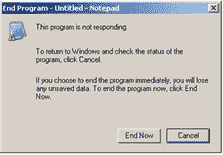
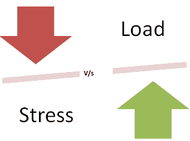
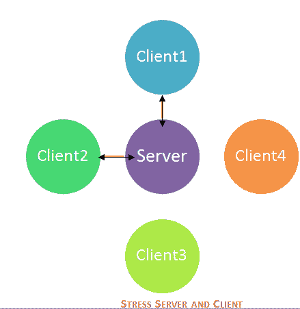

# 什么是软件测试中的应力测试？ 工具，类型，示例

> 原文： [https://www.guru99.com/stress-testing-tutorial.html](https://www.guru99.com/stress-testing-tutorial.html)

## 什么是压力测试？

**应力测试**是一种软件测试，用于验证系统的稳定性&可靠性。 该测试主要测量系统在极端重负载条件下的鲁棒性和错误处理能力。

进行了压力测试，以确保系统不会在紧急情况下崩溃。 它甚至可以进行超出正常工作点的测试，并评估系统在这些极端条件下的工作方式。

.png)

在软件工程中，压力测试也称为耐力测试。 在压力测试下，将在短时间内对 AUT 施加压力，以了解其承受能力。 压力测试的最主要用途**是确定系统，软件或硬件中断**的极限。 它还检查系统在极端条件下是否显示出有效的错误管理。

从网站复制 5GB 数据并将其粘贴在记事本中时，将对正在测试的应用程序施加压力。 记事本承受压力，并显示“未响应”错误消息。

.png)

在本教程中，您将学习-

*   [什么是压力测试？](#1)
*   [需要进行压力测试](#2)
*   [压力测试的目标](#3)
*   [负载测试与压力测试](#4)
*   [压力测试的类型](#5)
*   [如何进行压力测试？](#6)
*   [推荐用于压力测试的工具](#7)
*   [压力测试指标](#8)

## **需要进行压力测试**

考虑以下情形-

*   在节日期间，在线购物网站可能会出现流量激增或宣布销售的情况。
*   当一家领先的报纸提到博客时，博客的流量突然激增。

必须进行压力测试以适应这种异常的流量高峰。 无法适应这种突然的流量可能会导致收入损失和声誉受损。

由于以下原因，压力测试也非常有价值：

*   检查系统是否在异常情况下工作。
*   当系统处于压力状态时显示适当的错误消息。
*   极端条件下的系统故障可能导致巨大的收入损失
*   最好通过执行压力测试为极端条件做好准备。

## 压力测试的目标

压力测试的目的是分析故障后系统的行为。 为了使压力测试成功，在极端条件下，系统应显示适当的错误消息。

为了进行压力测试，有时会使用大量数据集，这些数据集在压力测试过程中可能会丢失。 测试人员在进行压力测试时不应丢失与安全相关的数据。

压力测试的主要目的是确保系统在故障后恢复，这称为**可恢复性**。

## 负载测试与压力测试

| 负载测试 | 压力测试 |
| [负载测试](/load-testing-tutorial.html)用于测试正常工作负载条件下的系统行为，它只是测试或模拟实际工作负载 | 压力测试是在极端条件下测试系统行为，并进行到系统故障为止。 |
| 负载测试不会破坏系统 | 压力测试试图通过对大量数据或资源进行测试来破坏系统。 |

## 压力测试的类型：

以下是压力测试的类型，并解释如下：

### **分布式压力测试：**

在分布式客户端服务器系统中，测试是跨服务器的所有客户端完成的。 压力服务器的作用是向所有压力客户端分发一组压力测试，并跟踪客户端的状态。 客户端与服务器联系后，服务器将添加客户端的名称并开始发送数据进行测试。

同时，客户端计算机发送信号或心跳信号表明已与服务器连接。 如果服务器未从客户端计算机收到任何信号，则需要对其进行进一步调查以进行调试。 从图中可以看出，服务器可以与 2 个客户端（Client1 和 Client2）连接，但不能发送或接收来自客户端 3 & 4 的信号。

夜间运行是运行这些压力测试方案的最佳选择。 大型服务器场需要一种更有效的方法来确定哪些计算机出现了压力故障，需要进行调查。

### **应用压力测试：**

该测试专注于查找与应用程序中的数据锁定和阻塞，网络问题以及性能瓶颈有关的缺陷。

### **交易压力测试：**

它对两个或多个应用程序之间的一个或多个事务进行压力测试。 它用于微调&以优化系统。

### **系统性压力测试：**

这是集成的压力测试，可以跨同一服务器上运行的多个系统进行测试。 它用于查找一个应用程序数据阻止另一应用程序的缺陷。

### **探索性压力测试：**

这是压力测试的一种类型，该压力测试用于测试具有在实际情况下不太可能发生的异常参数或条件的系统。 它用于发现意外情况下的缺陷，例如

1.  大量用户同时登录
2.  如果病毒扫描程序同时在所有计算机上启动
3.  如果从网站访问数据库时数据库已脱机，
4.  同时将大量数据插入数据库时

## 如何进行压力测试？

压力测试过程可以通过 5 个主要步骤完成：

1.  规划压力测试。 在这里，您可以收集系统数据，分析系统，定义压力测试目标
2.  创建自动化脚本：在此阶段，您将创建压力测试自动化脚本，生成压力场景的测试数据。
3.  脚本执行：在此阶段，您将运行压力测试自动化脚本并存储压力结果。
4.  结果分析：在此阶段，您将分析压力测试结果并确定瓶颈。
5.  调整和优化：在此阶段，您可以微调系统，更改配置，优化代码，以使其目标达到所需的基准。

最后，您再次运行整个周期，以确定这些调整已产生所需的结果。 例如，通常需要 3 到 4 个周期的压力测试过程来达到性能目标

## 推荐用于压力测试的工具：

### **[LoadRunner](/loadrunner-v12-tutorials.html)**

HP 的 LoadRunner 是一种广泛使用的负载测试工具。 由 Loadrunner 调整的负载测试结果被视为基准。

### **[测光表](/jmeter-tutorials.html)**

Jmeter 是一个开源测试工具。 它是用于压力和[性能测试](/performance-testing.html)的纯 [Java](/java-tutorial.html) 应用程序。 Jmeter 旨在涵盖测试类型，例如负载，功能，压力等。它需要 JDK 5 或更高版本才能起作用。

### **压力测试仪**

该工具提供了对 Web 应用程序性能的广泛分析，以图形格式提供了结果，并且非常易于使用。 不需要高级脚本，即可获得良好的投资回报。

### **新负载**

这是市场上流行的测试 Web 和[移动](/mobile-testing.html)应用程序的工具。 该工具可以模拟成千上万的用户，以便评估负载下的应用程序性能并分析响应时间。 它还支持云集成-性能，负载和压力测试。 它易于使用，具有成本效益并且提供了良好的可伸缩性。

## 压力测试指标

度量标准有助于评估系统的性能，通常在压力测试结束时进行研究。 常用的指标是-

**测量可伸缩性&性能**

*   每秒页面数：衡量已请求的页面数/秒
*   吞吐量：基本指标-响应数据大小/秒
*   回合：测试方案的计划次数与客户执行的次数

**应用程序响应**

*   命中时间：检索图像或页面的平均时间
*   到第一个字节的时间：花费时间返回数据或信息的第一个字节
*   页面时间：花费时间来检索页面中的所有信息

**失败**

*   失败的连接数：客户端拒绝的失败的连接数（弱信号）
*   失败的回合数：失败的回合数
*   失败命中次数：系统尝试失败的次数（链接断开或看不见的图像）

## 结论

压力测试的目的是在极端条件下检查系统。 它监视系统资源，例如内存，处理器，网络等，并检查系统恢复到正常状态的能力。 它检查系统在压力下是否显示适当的错误消息。