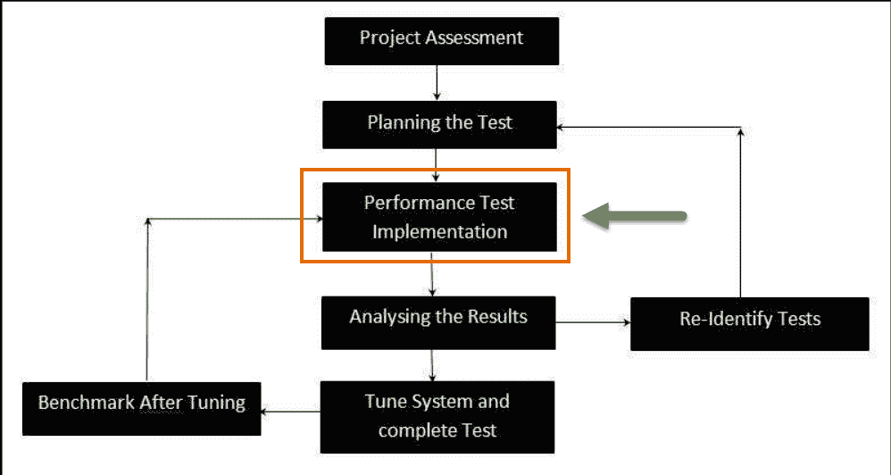

# 什么是浸泡测试？ 定义，含义，示例

> 原文： [https://www.guru99.com/soak-testing.html](https://www.guru99.com/soak-testing.html)

## 什么是浸泡测试？

**浸泡测试**是一种非功能性测试，可以在长时间的大量负载下测量系统的性能。 浸泡测试的目的是发现系统是否可以承受很高的使用量，并查看会在设计预期之外发生的情况。

下图描绘了一个测试周期，该周期显示了对应用程序执行浸泡测试（**性能测试**类型）的哪个阶段。

在这种类型的测试中，基本上监视的是系统中应用程序的内存利用率。 它正在系统级别进行测试，以发现系统是否可以承受很高的使用量，并查看会发生超出设计预期的情况。

在本教程中，您将学习-

*   [为什么要进行浸泡测试？](#2)
*   [何时进行浸泡测试？](#3)
*   [浸泡测试策略](#4)
*   [浸泡测试的特性](#5)
*   [浸泡测试的示例](#6)
*   [浸泡测试期间发现的常见问题](#7)

## 为什么要进行浸泡测试？

一个系统使用 2 个小时后可能会正常运行，但是如果连续使用 10 个小时或更长时间，则该系统可能会发生故障或出现异常/随机/崩溃的情况。 为了预测此类故障，将执行浸泡测试。

## 何时进行浸泡测试？

浸泡测试应在以下情况下进行：-

1.  在将构建的组件部署到客户端之前，即在特定平台上发布任何应用程序之前，它需要在高流量或等效流量级别成功进行一系列负载测试。 之后，进行**浸泡测试**。 它可以帮助我们确定如何长时间运行任何特定的应用程序。 如果在此期间（即处于浸泡状态）发现内存泄漏/内存损坏等问题，则应立即报告。
2.  进行浸泡测试的最佳时间是在周末，因为应用程序需要在一天或晚上的时间内保持运行状态。 这完全取决于测试情况的​​局限性。 浸泡测试是最重要的合规性要求之一，每个公司都必须严格遵守。

## 浸泡测试策略

**长期会话浸泡测试是一种策略，其中系统在较长时间处于负载状态。**

一个简单的例子是用户长时间登录到系统中执行许多业务交易。 这样，创建了很多数据。 系统/数据库服务器上可能有很多负载，这可能导致系统/数据库服务器停顿/崩溃。

在“长期浸泡测试”下，多天（例如 30 天）的活动在受限的时间范围内（例如 2 天）进行。 在此限制时间内的交易次数应等于或超过几天的交易额。 重点应放在处理的交易数量上。 保持测试最重要的部分是检查 CPU 中的可用内存以及将要使用的内存量。 我们需要在浸泡测试的开始和结束时记录内存使用情况。 如果有必要，那么诸如 [Java](/java-tutorial.html) 虚拟机之类的设施的内存使用也很重要，需要对其进行监视。

以下是开始进行浸泡测试之前，任何用户/测试人员都需要进行的其他几项检查：

a）监视数据库资源消耗。

b）监视服务器资源消耗（除 CPU 使用率）。

c）浸泡测试应在现实的用户并发下运行。

## 浸泡测试的特征

标准的浸泡测试方法应具有以下特征：-

*   大多数浸泡测试的持续时间通常取决于可用的时间。
*   如果需要延长时间，则任何应用程序都必须在不中断的情况下运行。
*   它应涵盖利益相关者同意的所有方案。
*   通常，每个系统都有一个定期的维护时段，这些时段之间的时间是确定浸泡测试范围的关键因素。

## 浸泡测试的示例

*   对于银行领域，当有大量商人的数据时，测试人员将在 70 到 150 个小时内连续将系统置于负载状态，以检查应用程序在此负载期间的行为。
*   假设有 33,000 个登录名，需要通过系统进行登录，它代表活动了 7 天半。 在这种情况下，可以在星期五晚上 6 点左右开始进行 60-70 小时的浸泡测试，该测试可以在星期一早上 6 点之前完成。 只有通过这样的测试，才有可能在受控条件下观察性能的任何下降。
*   对于视频游戏，[移动](/mobile-testing.html)应用程序等涉及以各种操作模式（例如，空转，在标题屏幕上暂停和 以便找出应用程序是否可以处理持续的预期负载。

## 浸泡测试期间发现的常见问题

1.  内存分配（内存泄漏最终会导致内存危机或仅随时间推移而出现的舍入错误）。
2.  数据库资源利用率（在某些情况下无法关闭数据库游标，最终将导致整个系统停滞）。
3.  它还可能导致性能下降，即确保长时间持续活动后的响应时间与测试开始时一样好。
4.  在某些情况下，无法关闭多层系统的层之间的连接可能会导致系统的某些或所有模块停顿。
5.  在长时间的测试中，某些功能作为内部数据结构的响应时间的逐渐降低变得效率较低。

### 摘要

*   在软件工程中，进行 Soak 测试以确定被测试的应用程序是否可以承受持续的负载。
*   这是一种性能测试。
*   它帮助系统确定它是否可以承受很高的使用量
*   在这种类型的测试中，基本上监视的是系统中应用程序的内存利用率
*   在开始进行浸泡测试之前，任何用户/测试人员都需要进行的检查包括
    *   监视数据库资源消耗。
    *   监视服务器资源消耗（除 CPU 使用率）。
    *   浸泡测试应与现实的用户并发一起运行。

***本文由 Pallavi De*** 提供