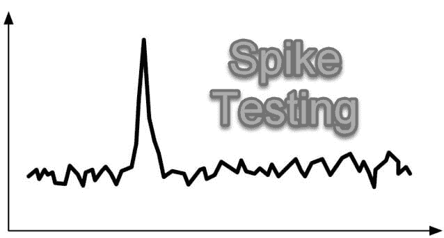

# 什么是峰值测试？ 通过示例学习

> 原文： [https://www.guru99.com/spike-testing.html](https://www.guru99.com/spike-testing.html)

## 什么是峰值测试？

**SPIKE TESTING** is defined as a type of performance testing in which application is tested with extreme increment and decrements in the load. The purpose of Spike Testing is to determine the recovery time after a spike of user load.It is performed to estimate the weakness of an application.

它有助于评估用户负载突然增加或减少时软件系统的行为。

在本教程中，我们将学习-

*   [什么是峰值测试？](#1)
*   [峰值测试的目标](#2)
*   [如何执行峰值测试？](#3)
*   [峰值测试场景示例：](#4)
*   [峰值负载的恢复方案](#5)
*   [峰值测试的优缺点](#6)
*   [峰值测试工具：](#7)

## 峰值测试的目标

Spike 测试的目标是查看系统如何响应用户负载的意外上升和下降。 在软件工程中，峰值测试有助于确定突然出现高负载时系统性能是否会下降。

峰值测试的另一个目标是确定恢复时间。 在用户负载的两个连续峰值之间，系统需要一些时间才能稳定下来。 恢复时间应尽可能短。

### 如何执行峰值测试？

这是执行尖峰测试的六个简单步骤

**步骤 1）**确定软件应用程序的最大用户负载容量

**步骤 2）**准备测试环境并将其配置为记录性能参数。

**步骤 3）**使用您选择的性能工具将预期的最大负载应用于软件应用程序

**步骤 4）**在设定的时间内，系统的负载迅速增加。

**步骤 5）**逐渐将负载降低到原始水平。

**步骤 6）**分析性能图。 要考虑的指标是失败，花费的时间，虚拟用户等。

## 峰值测试方案示例：

*   当电子商务商店正在以折扣价推出特惠时，例如黑色星期五。
*   当 Web 应用程序正在实时流式传输时，喜爱的电视节目。
*   当日常交易网站上进行快速促销时。
*   当网站的某些内容通过 Internet 传播时。
*   已发布新系统以进行生产，并且有多个用户想要访问该系统。
*   停电可能会导致所有用户失去对系统的访问权限。 中断问题解决后，所有用户随后将同时登录到系统。

## 峰值负载的恢复方案

可以配置三种主要的恢复方案以防止出现峰值

1.  使用 AWS，Azure 等云平台与用户负载一起动态增加服务器容量
2.  不允许某些用户访问该应用程序，这样系统就不会面临沉重的负担。 这样可以阻止超过最大设计负荷的人员进入系统。 从而保护系统免受过度负载的威胁。
3.  网站管理员允许用户加入系统。 但是请警告他们，由于重负荷，它们可能会面临响应缓慢的问题。 这可能会对系统性能造成不利影响。 但是，用户将能够使用该系统。

## 峰值测试的优缺点

| **优势** | **劣势** |
| 

*   必须不惜一切代价维护软件的性能。 但是，当任何系统的负载急剧增加时，出现问题的可能性就很大。 峰值测试有助于测试这种情况。

 | 

*   峰值测试的唯一缺点是它是昂贵的测试过程。 因此，它需要设置特殊的测试条件。 但是，在更长的时间内，它肯定会带来正的 ROI。

 |
| 

*   在标准测试方法中，可能无法解决从坏到最坏的情况。 但是，忽略它们并不意味着它们将永远不会发生。 因此，每个软件都应为这种可能性做好准备。 这样的最坏情况就是负载，可以通过尖峰测试来判断并最小化负载。

 |   |

## 峰值测试工具：

1）[仪表](/jmeter-tutorials.html)

Apache JMeter 是 Java 开源峰值测试工具。 它是专门设计用来加载功能测试行为并衡量性能的。 该性能测试工具可用于分析和衡量 Web 应用程序或各种服务的性能。 如今，它已广泛用于功能测试，数据库服务器测试。

2） [Loadrunner](/loadrunner-v12-tutorials.html)

Loadrunner 是 Windows 和 Linux 的负载测试工具，它可以对 Web 和其他应用程序进行峰值测试。 即使在重负载下，它也有助于确定应用程序的性能和结果。

## 结论：

*   峰值测试是一种软件测试方法。 在这种方法中，应用程序以不寻常的负载增减进行测试。
*   进行峰值测试的正确方法是意外增加用户数量，然后立即减少负载。
*   意外负载是交易的主要属性。
*   现实生活中的 Spike 测试方案的示例有-当电子商务商店正在以折扣价推出特惠时，例如在黑色星期五。 或者，当 Web 应用程序正在直播流式传输喜欢的电视节目时。
*   Jmeter 是执行峰值测试的一种有用工具。