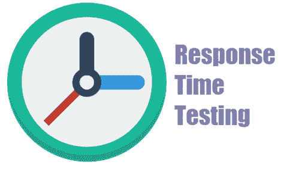

# 什么是响应时间测试？

> 原文： [https://www.guru99.com/response-time-testing.html](https://www.guru99.com/response-time-testing.html)

## 什么是响应时间测试？

**响应时间测试**衡量一个系统节点响应另一个请求的时间。 这是系统达到特定输入直到过程结束为止的时间。 例如，您拥有 API，并且您想确切地知道执行它和以 JSON 返回数据所花费的时间。 响应时间衡量每个事务或查询的服务器响应。

响应时间从用户发送请求开始，到应用程序声明请求已完成时结束。

在本教程中，您将学习

*   [什么是响应时间测试？](#1)
*   [如何测量响应时间？](#2)
*   [响应指标的类型](#3)
*   [三个重要的响应时间值](#4)
*   [响应时间测试工具](#5)

## 如何测量响应时间？

响应时间是在测试工具的帮助下，将重要的业务流程与“开始”和“结束”事务相关联来衡量的。 业务流程可以是用户在应用程序中执行以完成业务任务的一个动作或一组动作。 例如，登录该应用程序或在 Amazon.com 上购买书籍。

对于相同的过程，响应因工具而异。 这就是为什么

*   计算每个工具收集的指标的方法
*   工具模拟加载和捕获速度，这可能会缩短响应时间
*   监视用户负载时记录的额外项目
*   由于高资源消耗，每个工具收集的计算指标会增加响应时间。
*   两种工具的架构可能不同

## 响应指标的类型：

| **响应时间指标** | **解释** |
| 平均响应时间 | 平均响应时间是每个往返请求所花费的平均时间。 “平均响应时间”包括 HTML，CSS，XML，图像，JavaScript 文件等的加载时间。因此，当系统中存在慢速组件时，平均值会受到影响。 |
| 峰值响应时间 | 高峰响应时间可帮助我们发现可能存在问题的组件。 它可以帮助我们发现某些请求未得到正确处理的网站或系统中的所有违规行为。 例如，可能会执行大型数据库查询，这可能会影响响应时间。 此查询不允许页面在所需的时间加载。 |
| 错误率 | 错误率是一种数学计算，可显示问题请求相对于所有请求的百分比。 此百分比计算在服务器上显示错误的所有 HTTP 状态代码。 它还会计数超时的请求。 |

## 三个重要的响应时间值：

响应时间测试具有两个最基本的特征：

*   平均响应时间
*   最大响应时间。

它显示用户需要等待服务器响应其请求的时间。

以下是关键响应时间值

| 响应时间 | 意义 |
| 0.1 秒 | 这是最优选的响应时间。 如果响应时间为 0.1，则用户始终会感觉到应用程序或系统正在立即响应，并且不会感到任何中断。 |
| 1.0 秒 | 它定义为可接受的响应时间的最大限制。 用户可能不会感到任何中断，尽管他们可能会遇到一些延迟。 超过 1 秒的响应时间可能会中断用户体验。 |
| 10 秒 | 这是最大限制，之后响应时间超出可接受的限制。 但是，在今天的时间里，如果响应时间超过 6 秒，则用户将离开该站点或退出该应用程序。 |

通常，响应时间应在 0.1-1 秒的间隔内尽可能快。 但是，人们可以适应较慢的响应时间，但是响应时间超过 2 秒永远不会满足。 响应时间越短，客户满意度就越高，成本越低，客户满意度就越高。

## 响应时间测试工具：

市场上有许多响应时间测试工具。 三个最著名的名字是：

**1）JMeter：**

Jmeter 可用于目标应用程序上的负载和性能测试。

**下载链接：** [http://jmeter.apache.org/download_jmeter.cgi](http://jmeter.apache.org/download_jmeter.cgi)

**2）Load Runner：**

Load Runner 是 Microfocus 开发的负载测试产品。 LoadRunner 响应测试工具的工作原理是在主题应用程序上模拟虚拟用户。

**下载链接：** [https://software.microfocus.com/de-de/products/loadrunner-load-testing/free-trial](https://software.microfocus.com/de-de/products/loadrunner-load-testing/free-trial)

**3）AEM：**

Adobe Experience manage（简称为 AEM）是另一个测试响应时间的有效工具。 它允许检查有问题的查询，请求和错误消息。

**下载链接：** [https://helpx.adobe.com/in/experience-manager/6-3/sites/developing/using/aem-eclipse.html](https://helpx.adobe.com/in/experience-manager/6-3/sites/developing/using/aem-eclipse.html)

## 结论：

*   响应时间是指一个系统节点响应另一个请求所花费的时间
*   平均响应时间是每个往返请求所花费的平均时间
*   峰值响应时间可帮助我们发现哪些组件可能有问题。
*   错误率是一种数学计算，显示问题请求的百分比。
*   三个关键的响应时间值为：0.1 秒，1.0 秒和 10 秒
*   三种最常用的响应时间测试工具是 Jmeter，LoadRunner 和 AEM。