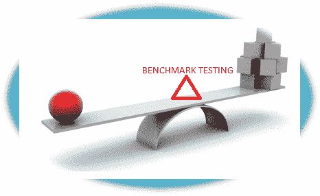
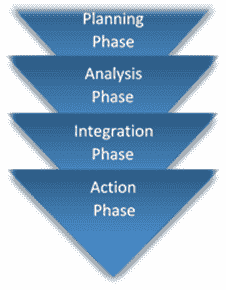

# 什么是基准测试？ 测试计划，工具，示例

> 原文： [https://www.guru99.com/benchmark-testing.html](https://www.guru99.com/benchmark-testing.html)

在学习基准测试之前，让我们了解一下-

### 什么是基准？

基准是可以与之比较产品/服务以评估产品/服务质量的度量或参考点。

换句话说，“基准测试”是指有助于确定产品或服务质量的设定标准。 例如，一个橄榄球队有一个基准来让一名球员有资格成为**英超联赛球员。** 基准测试的技能可以是过去五个赛季打进的多个进球，或者是上半场的控球，或者是当地比赛中打出的最少比赛等。

在软件行业，您可以对软件产品或服务进行基准测试以评估其质量。

## 什么是基准测试？

**基准测试**测量一组可重复的可量化结果，作为可与之比较产品/服务的参考点。 基准测试结果的目的是将当前和将来的软件版本与各自的基准进行比较。

基准必须是**可重复**。 例如，在每次负载迭代测试中，如果响应时间变化太大，则以系统性能为基准。 在不同的负载条件下，响应时间必须保持稳定。

基准必须是可量化的。 例如，不能以数量来量化用户体验，但是可以归因于良好的 UI 来使用户在网页上花费的时间得以量化。

**基准测试不仅与软件测试相关，而且还涉及硬件测试**，被认为是业务领域中最重要的任务之一。

在本教程中，我们将讨论客户端服务器应用程序或其他词 Web 应用程序的基准。

可以对以下服务进行基准测试，

*   浏览器兼容性
*   链接断开
*   符合 HTML
*   加载时间
*   辅助功能
*   链接流行度

在本教程中，您将学习-

*   [为什么基准测试很重要](#1)
*   [制定基准测试计划](#2)
*   [基准测试框架](#3)
*   [基准测试](#4)时应考虑的事项
*   [基准测试的组成部分](#5)
*   [基准测试工具](#6)

## 为什么基准测试很重要

在业务级别，基准测试有助于确定

*   基于网络的应用程序相对于竞争对手的表现如何
*   不同类型的客户如何体验网站的响应时间和可用性
*   它确保网站符合标准和最佳实践
*   它使您能够在做出签约决策之前评估第三方服务提供商
*   允许找出要避免的错误

## 创建基准测试计划

测试计划是基准测试过程中最关键的元素。 基准测试计划遵循以下步骤；

1.  扩展和调用工作负载
2.  收集并存储度量以进行基准测试
3.  定义所需的时间跨度和测试过程的终点
4.  准备备份计划以克服任何新的测试用例失败
5.  确定授权终止过程的呼叫

**基准测试的各个阶段**

基准测试涉及四个阶段：

1.  **规划阶段**
    *   确定标准和要求并确定其优先级
    *   确定基准标准
    *   定义基准测试流程
2.  **分析阶段**
    *   找出错误的根本原因以提高质量
    *   为测试过程设定目标
3.  **集成阶段**
    *   与相关人员分享结果并获得批准
    *   建立功能目标
4.  **行动阶段**
    *   制定测试计划和文档
    *   实施先前阶段中指定的操作并监视进度
    *   持续运行过程

## 基准测试框架

基准测试框架有助于执行一些基本任务以进行性能检查。

这些基本任务包括：

1.  数据库访问
2.  服务器端组成
3.  JSON 序列化
4.  组态

**Benchmark Framework 2.0** & **TechEmpower** 主要用于基准测试框架

让我们来看看 TechEmpower。 我们将快速浏览其主要功能

*   这是一个执行基准测试任务的开源框架
*   需要正确配置基准测试环境
*   主要有两种模式，例如用于比较结果的**基准模式**和用于非专业人士的**验证模式**
*   需要几个文件，这些文件是唯一的，并且可能因系统而异
*   它包括“基准配置文件”，用于定义基准程序的一组测试指令和元数据
*   它基于多种语言，例如 Java，Python，Ruby，PHP，JavaScript，Perl，C，Groovy，Haskell，Scala 等。
*   对象–关系映射器（ORM）用于对数据库，JSON 序列化等执行测试。

## 基准测试时应考虑的事项

*   **一致性和控制性**是执行基准测试的重要措施
*   了解系统架构以设计测试标准和测试数据
*   检查初始静态数据并根据许多用户进行更新
*   随时检查“重置”功能，并定义每秒的事务处理速率（这专门针对用户对数据库的事务处理）
*   根据功能拆分系统元素
*   每个系统具有不同的体系结构和设计，在执行基准测试时需要考虑这些因素

## 基准测试的组成部分

不同的系统具有不同程度的复杂性，并且需要不同的技术来测试应用程序。

基准测试包含 3 个主要组成部分。 他们是

1.  **工作负载规格：**确定要提交给被测系统的请求的类型和频率。
2.  **度量规格：**确定要测量的元素，例如； 下载速度
3.  **测量规格：**确定如何测量指定的元素以找到合适的值

为了进行成功的基准测试，需要考虑以下事实。

1.  确保所有软件组件均正常运行
2.  操作系统和支持的驱动程序应正确运行
3.  在运行基准测试之前，从系统中删除预取和临时文件
4.  关闭后台运行的所有进程和应用程序
5.  检查操作系统更新和实际配置

## 基准测试工具

基准测试工具也进行了相应的分类。 我们将一一征募。

**用于测试 Windows PC 的工具：**

1.  [Prime95](http://www.mersenne.org/download/)
2.  [Novabench](https://novabench.com/)
3.  [3DMark](https://www.3dmark.com/)
4.  [SiSoftware Sandra](https://www.sisoftware.co.uk/)

**测试 CPU 性能的工具：**

1.  Cinebench
2.  [Geekbench](http://geekbench.com/)

**测试系统速度和移动设备电池的工具：**

1.  Phoronix（Linux）
2.  [CPU-M](http://www.majorshare.com/cpu-m-benchmark/) （CPU 基准测试）
3.  Vellamo（Web 浏览性能）

**用于在不同机器之间执行比较基准测试的工具：**

[Everest Ultimate Edition](http://www.lavalys.com/products/everest-pc-diagnostics/)

基准测试也可以在 Android 手机和平板电脑上执行，上面列出了一些相同的工具。 在所有的 ****密码**** 中，是众所周知且使用广泛的基准测试工具。

**摘要**

*   在软件工程中，基准测试可对系统性能给出一组可重复的量化结果。
*   有助于锻炼负载条件并确定针对 DDoS 攻击的系统行为。
*   工作负载规范，度量规范和度量规范是基准测试的主要组成部分。
*   有几种工具和框架可用于快速有效地执行基准测试。
*   基准测试对移动设备也很有用。

***本文由 Dhanashri Salvi 提供***