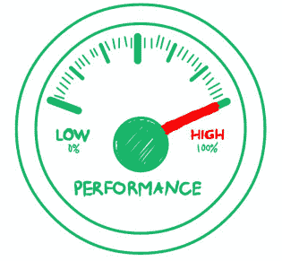

# 什么是软件测试中的耐久性测试？ （带有示例）

> 原文： [https://www.guru99.com/endurance-testing.html](https://www.guru99.com/endurance-testing.html)

## 什么是耐力测试？

**持久性测试**是一种软件测试类型，其中对负载进行测试的系统经过了相当长的时间，以评估系统在持续使用下的行为。 测试的目的是确保应用程序有足够的能力来处理扩展的负载，而不会缩短响应时间。

这种类型的测试在性能运行周期的最后阶段执行。 耐力测试是一个漫长的过程，有时甚至可持续长达一年。 这可能包括施加外部负载，例如 Internet 流量或用户操作。 这使得耐久性测试与[负载测试](/load-testing-tutorial.html)不同，后者通常会在几个小时左右结束。

*耐力表示容量，因此，可以将耐力测试称为容量测试。*

在本教程中，您将学习-

*   [什么是耐力测试？](#1)
*   [耐力测试的目标](#2)
*   [耐力测试中要监视的内容](#3)
*   [如何执行耐力测试](#4)
*   [耐力测试示例](#5)
*   [耐力测试工具](#6)
*   [耐力测试的优势](#7)
*   [耐力测试的缺点](#8)

## 耐力测试的目标

*   耐力测试的主要目标是检查内存泄漏。
*   发现系统在持续使用下的性能。
*   为确保经过很长一段时间，系统响应时间将保持与开始测试相同或更好。
*   为了确定用户和/或交易的数量，给定的系统将支持并达到性能目标。
*   要管理将来的负载，我们需要了解为支持将来的使用需要增加多少资源（例如处理器容量，磁盘容量，内存使用或网络带宽）。
*   耐久性测试通常通过使系统超载或减少某些系统资源并评估后果来完成。
*   执行该步骤以确保在被认为是相对“正常”的使用期之后不会发生缺陷或内存泄漏。

## 耐力测试中要监视的内容

在耐力测试中，将测试以下内容。

*   **测试内存泄漏**-检查应用程序中是否存在任何内存泄漏，这可能导致系统或操作系统崩溃。
*   **测试系统层之间的连接关闭** –如果系统层之间的连接未成功关闭，则可能使系统的某些或所有模块停顿。
*   **测试数据库连接成功关闭**-如果数据库连接未成功关闭，则可能导致系统崩溃
*   **测试响应时间** –由于长时间使用系统导致应用程序效率降低，因此对系统的响应时间进行了测试。

## 如何执行耐力测试

以下是耐力测试的基本测试方法

*   **测试环境–** 确定耐久性测试所需的硬件，软件，操作系统，在团队中分配角色和职责等。在执行测试之前，应准备好环境。 您还需要估计通用数据库的生产规模和年增长率。 这是必需的，因此您需要测试您的应用程序在一年，两年或五年后的响应方式。
*   **创建测试计划，方案-**根据测试的性质-手动或自动化或两者的结合，应计划[测试用例](/test-case.html)的设计，审查和执行。 强调系统性能的测试，断点测试等也应该成为测试计划的一部分。 对系统施加压力的测试确定了应用程序中的断点。
*   **测试估计–** 提供完成测试阶段所需时间的估计。 应该根据所涉及的测试人员和所需测试周期的数量来进行分析。
*   **风险分析-**分析风险并采取适当的预防措施。 根据风险因素确定测试案例的优先级，并确定以下风险和测试人员可能会在耐力测试中分阶段进行。
    *   随着时间的推移，性能会保持一致吗？
    *   还有其他未发现的小问题吗？
    *   是否有未解决的外部干扰？
*   **测试计划-**确定预算，可交付成果。 由于**耐久性测试**在连续的一段时间内将巨大但自然的交易负载应用于系统/应用程序。

## 耐力测试示例

**压力测试**使受测系统达到其极限，而**耐久性测试**使该应用随着时间推移达到其极限**。**

例如，最复杂的问题-内存泄漏，数据库服务器利用率和系统无响应-会在软件长时间运行时发生。 如果跳过耐久性测试，则在部署之前检测到此类缺陷的机会就非常低。

## 耐力测试工具

*   Web 加载
*   加载完成
*   [Apache JMeter](/jmeter-tutorials.html)
*   [LoadRunner](/loadrunner-v12-tutorials.html)
*   前进
*   LoadUI
*   OpenSTA 的
*   Rational Performance Tester

## 耐力测试的优势

*   它有助于确定负载系统如何处理工作负载。
*   提供客户可以用来验证或增强其基础架构需求的准确数据。
*   标识在系统长时间较高级别运行之后可能出现的性能问题
*   在较小的目标性能测试中确定了典型问题，这意味着即使在非常短的时间内有巨大的负载，它也可以确保应用程序仍然可用。
*   耐久性测试还用于检查长时间执行后性能是否下降

## 耐力测试的缺点

*   通常很难定义多少压力值得施加。
*   如果未隔离[测试环境](/test-environment-software-testing.html)，则耐久性测试可能会导致应用程序和/或网络故障，从而可能导致严重中断。
*   压力过大可能会导致永久性的数据丢失或损坏。
*   消除压力后，资源利用率仍然很高。
*   某些应用程序组件无法响应。
*   最终用户会观察到未处理的异常。

**摘要：**

*   在软件工程中，耐久性测试是负载测试的子集。
*   耐力测试是一个漫长的过程，有时甚至可持续长达一年
*   完成检查以验证
    *   测试内存泄漏
    *   测试响应时间
    *   测试数据库连接等

***由于 Unnati Soni 的贡献，使本文成为可能。***