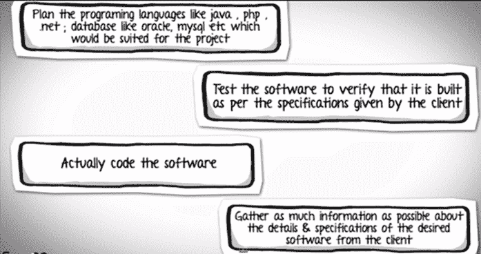
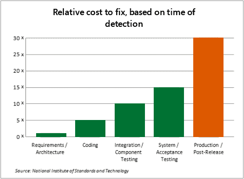
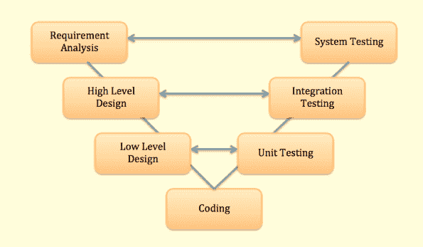

# 软件测试中的 V 模型

> 原文： [https://www.guru99.com/v-model-software-testing.html](https://www.guru99.com/v-model-software-testing.html)

## 什么是 V 模型？

**V 模型**是 SDLC 模型，其测试阶段对应于瀑布模型的每个开发阶段。 它被称为“ vee”模型。 V 模型是瀑布模型的扩展。 V 模型测试与开发并行进行。 它也称为验证和验证模型。

## 关键软件工程术语：

**SDLC：** SDLC 是软件开发生命周期。 这是开发人员设计和开发高质量软件的一系列活动。

**STLC：** STLC 是软件测试生命周期。 它包含测试人员在方法上进行的一系列活动，以测试您的软件产品。

**瀑布模型：**瀑布模型是一个顺序模型，分为软件开发活动的不同阶段。 每个阶段都旨在执行特定的活动。 仅在系统实施完成后，瀑布模型的测试阶段才开始。

## 示例了解 V 模型

假设您被分配了一项任务，以为客户端开发自定义软件。 现在，无论您的技术背景如何，都可以对您将要完成的任务的步骤顺序进行有根据的猜测。

正确的顺序是。

| **软件开发周期的不同阶段** | 

**在每个阶段进行的活动**

 |
| **需求收集阶段** | 

*   从客户端收集有关所需软件的详细信息 & 规格的尽可能多的信息。 这仅是需求收集阶段。

 |
| **设计阶段** | 

*   规划编程语言，例如 [Java](/java-tutorial.html) ， [PHP](/php-tutorials.html) ，.net； 像 Oracle，MySQL 等这样的数据库将适合该项目，还有一些高级功能 & 体系结构。

 |
| **构建阶段** | 

*   在设计阶段之后，是构建阶段，只不过是对软件进行了编码

 |
| **测试阶段** | 

*   接下来，您测试软件以验证它是否按照客户端给出的规范构建。

 |
| **部署阶段** | 

*   在相应的环境中部署应用程序

 |
| **维护阶段** | 

*   系统准备就绪后，您可能需要稍后根据客户要求更改代码

 |

所有这些级别构成了软件开发生命周期的**瀑布方法**。

## 瀑布模型的问题

您可能会看到，仅在实现完成后才开始在模型中进行**测试。**

但是，如果您在系统复杂的大型项目中工作，很容易在需求阶段本身中遗漏关键细节。 在这种情况下，完全错误的产品将交付给客户，您可能必须重新开始项目，或者如果您设法正确地记录了要求，但是在软件的设计和体系结构上犯了严重错误，则必须重新设计 整个软件纠正错误。

对数千个项目的评估表明，在需求&设计期间引入的**缺陷几乎占缺陷总数的一半。**

同样，在整个开发生命周期中，修复缺陷的**成本也会增加。 生命周期中越早发现缺陷，修复它的成本就越低。** 正如他们所说，“一针一针可节省九分。”

## 解决方案：V 模型

为解决此问题，开发了 **V 测试模型**，其中每个阶段的**，在开发生命周期中都有一个相应的测试阶段**

*   模型的左侧是软件开发生命周期- **SDLC**
*   模型的右侧是软件测试生命周期- **STLC**
*   整个图形看起来像 V，因此名称 **V-型号**

除了 V 模型外，还有迭代开发模型，其中的开发是分阶段进行的，每个阶段都为软件添加了功能。 每个阶段都包含其独立的一组开发和测试活动。

遵循迭代方法的开发生命周期的好例子是快速应用程序开发，敏捷开发

### 结论

有许多开发生命周期模型。 **为项目选择的开发模型取决于该项目的目的和目标。**

*   测试不是独立的活动，它必须适应为项目选择的开发模型。
*   在任何模型中，都应在所有级别上进行测试，即从需求到维护为止。