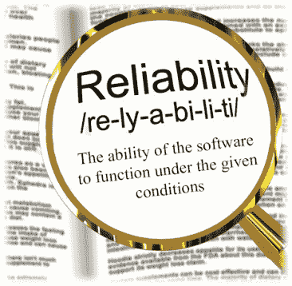
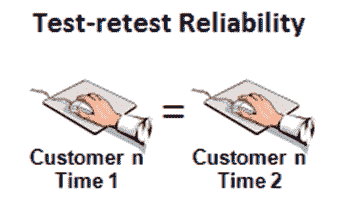
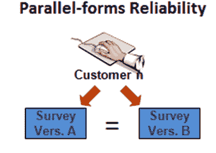

# 可靠性测试教程：什么是方法，工具，示例

> 原文： [https://www.guru99.com/reliability-testing.html](https://www.guru99.com/reliability-testing.html)

## 什么是可靠性测试？

**可靠性测试**是一种软件测试类型，用于检查软件在特定环境中是否可以在指定的时间段内执行无故障操作。

可靠性的意思是“屈服于同一事物”，换句话说，“可靠的”一词意味着事物是可靠的，并且每次都会给出相同的结果。 可靠性测试也是如此。 软件中的可靠性测试可确保产品无故障且对预期目的可靠。

在本教程中，您将学习-

*   [什么是可靠性测试？](#1)
*   [可靠性测试示例](#2)
*   [影响软件可靠性的因素](#3)
*   [为什么要进行可靠性测试](#4)
*   [可靠性测试的类型](#5)
*   [如何进行可靠性测试](#6)
*   [可靠性测试的示例方法](#7)
*   [可靠性测试工具](#8)

## 可靠性测试示例

商店中的 PC 开机并运行八个小时而不会崩溃的概率为 99％； 这称为可靠性。



可靠性测试可以分为三个部分，

*   造型
*   测量
*   改善

以下公式用于计算故障概率。

```
Probability = Number of failing cases/ Total number of cases under consideration
```

## 影响软件可靠性的因素

1.  软件中出现的故障数
2.  用户操作系统的方式

*   可靠性测试是提高软件质量的关键之一。 该测试有助于发现软件设计和功能中的许多问题。
*   可靠性测试的主要目的是检查软件是否满足客户可靠性的要求。
*   可靠性测试将在多个级别上进行。 复杂的系统将在单元，组件，子系统和系统级别进行测试。

## 为什么要进行可靠性测试

在给定条件下进行可靠性测试以测试软件性能。

进行可靠性测试的目的是，

1.  查找重复失败的结构。
2.  查找发生的故障数是指定的时间量。
3.  发现失败的主要原因
4.  修复缺陷后，进行软件应用程序各个模块的[性能测试](/performance-testing.html)

在产品发布之后，我们也可以最大程度地减少发生缺陷的可能性，从而提高软件的可靠性。 对此有用的一些工具是-趋势分析，正交[缺陷](/defect-management-process.html)分类和形式方法等。

## 可靠性测试的类型

软件可靠性测试包括功能测试，[负载测试](/load-testing-tutorial.html)和[回归测试](/regression-testing.html)

**功能测试：-**

特色测试检查软件提供的功能，并按照以下步骤进行：

*   软件中的每个操作至少执行一次。
*   减少了两个操作之间的交互。
*   必须检查每个操作是否正确执行。

**负载测试：-**

通常，该软件在流程开始时会表现更好，然后开始降级。 进行负载测试以检查软件在最大工作负载下的性能。

**回归测试：-**

回归测试主要用于检查是否由于修复了先前的错误而引入了任何新的错误。 在每次更改或更新软件功能及其功能之后，都要进行回归测试。

## 如何进行可靠性测试

与其他类型的测试相比，可靠性测试的成本很高。 因此，进行可靠性测试时需要适当的计划和管理。 这包括要实施的测试过程，测试环境的数据，测试时间表，测试点等。

要进行可靠性测试，测试人员必须注意以下事项：

*   建立可靠性目标
*   制定业务概况
*   计划和执行测试
*   使用测试结果来制定决策

正如我们前面讨论的，可以在其中进行可靠性测试的三类，即**建模，测量和改进**。

可靠性测试涉及的关键参数是：

*   无故障运行的可能性
*   无故障运行时间
*   执行它的环境

### 步骤 1）建模

软件建模技术可以分为两个子类别：

**1.预测建模**

**2.估算模型**

*   通过应用合适的模型可以获得有意义的结果。
*   Assumptions and abstractions can be made to simplify the problems and no single model will suitable for all the situations.

    两种模式的主要区别是：

| 问题 | **预测模型** | **估算模型** |
| **数据参考** | 它使用历史数据 | 它使用软件开发中的最新数据。 |
| **在开发周期**中使用时 | 通常将在开发或测试阶段之前创建它。 | 通常将在软件开发生命周期的后期使用它。 |
| **时间范围** | 它将预测未来的可靠性。 | 它将预测当前时间或将来时间的可靠性。 |

### 步骤 2）测量

无法直接测量软件可靠性，因此，为了评估软件可靠性，需要考虑其他相关因素。 软件可靠性测量的当前实践分为四类：

1\. **产品指标：-**

产品指标是 4 种类型的指标的组合：

*   **软件大小**：-代码行（LOC）是测量软件大小的直观直观方法。 此度量标准仅计入源代码，而注释和其他不可执行的语句将不计入。
*   **功能点指标**：-功能 Pont Metric 是用于测量软件开发功能的方法。 它将考虑输入，输出，主文件等的计数。它衡量交付给用户的功能，并且与编程语言无关。
*   **复杂度**：-它直接关系到软件的可靠性，因此表示复杂度很重要。 面向复杂性的度量是一种通过将代码简化为图形表示形式来确定程序控制结构的复杂性的方法。
*   **测试覆盖率指标**：-这是通过对软件产品进行完整的测试来估计故障和可靠性的方法。 软件可靠性意味着它是确定系统已被完全验证和测试的功能。

2\. **项目管理指标**

*   研究人员已经意识到，良好的管理可以生产出更好的产品。
*   好的管理可以通过使用更好的开发过程，风险管理过程，配置管理过程等来获得更高的可靠性。

3\. **流程指标**

产品的质量与过程直接相关。 流程指标可用于估计，监视和改善软件的可靠性和质量。

4\. **故障和失败指标**

故障和故障度量标准主要用于检查系统是否完全无故障。 收集，汇总和分析在测试过程中（即交付之前）发现的故障类型以及用户交付后报告的故障，以实现此目标。

软件可靠性是根据**平均无故障时间（MTBF）**来衡量的。 MTBF 由

*   失效平均值（MTTF）：两次连续失效之间的时间差
*   平均修复时间（MTTR）：这是修复故障所需的时间。

```
MTBF = MTTF + MTTR
```

优质软件的可靠性介于 **0 和 1 之间。**

删除程序中的错误或错误后，可靠性会提高。

### 步骤 3）改善

改进完全取决于应用程序或系统中发生的问题，或者软件的特性。 根据软件模块的复杂性，改进的方式也会有所不同。 限制时间和预算的两个主要限制因素将限制软件的可靠性改进工作。

## 可靠性测试的示例方法

可靠性测试是关于应用程序的运行，以便在部署系统之前发现并消除故障。

可靠性测试主要使用三种方法

*   重测可靠性
*   平行表格的可靠性
*   决策一致性

下面我们试图用一个例子来解释所有这些。

### 重测可靠性



为了估计重测的可靠性，一组考生将仅隔几天或几周执行一次测试过程。 时间应足够短，以便可以评估该地区的考生技能。 通过统计相关性估算来自两个不同主管部门的考生得分之间的关​​系。 这种类型的可靠性说明了测试能够在多长时间内产生稳定，一致的分数的程度。

### 平行表格的可靠性



许多考试都有多种形式的试卷，这种并行形式的考试可提供安全性。 并行形式的可靠性是通过将两种形式的考试管理给同一组被测者来估计的。 关联两个测试表单上的考生分数，以确定两个测试表单的功能相似程度。 可靠性评估是衡量应试者在各个测试表格中获得一致分数的量度。

### 决策一致性

在进行了“重新测试可靠性”和“并行表格可靠性”之后，我们将获得通过或失败的考生结果。 决策一致性可靠性中估计的就是该分类决策的可靠性。

可靠性测试的重要性

需要对可靠性进行彻底评估，以提高软件产品和过程的性能。 测试软件可靠性将在很大程度上帮助软件经理和从业人员。

通过测试来检查软件的可靠性：

1.  应该将大量测试用例执行较长的时间，以找出软件将执行多长时间而不会出现故障。
2.  测试用例的分布应与软件的实际或计划的操作配置文件相匹配。 执行软件功能的频率越高，应分配给该功能或子集的测试用例的百分比就越大。

## 可靠性测试工具

用于软件可靠性的一些工具是

1\. WEIBULL ++：-可靠性寿命数据分析

2\. RGA：-可靠性增长分析

3\. RCM：以可靠性为中心的维护

**摘要：**

可靠性测试是可靠性工程计划的重要组成部分。 更正确地说，这是可靠性工程程序的灵魂。

此外，可靠性测试的主要目的是在软件测试期间发现特定的故障模式和其他问题。

在软件工程中，可靠性测试可以分为三个部分，

*   造型
*   测量
*   改善

影响软件可靠性的因素

*   软件中出现的故障数
*   用户操作系统的方式