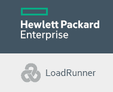

# 13 个最佳性能测试工具| 负载测试工具（2020）

> 原文： [https://www.guru99.com/performance-testing-tools.html](https://www.guru99.com/performance-testing-tools.html)

性能测试工具可帮助您确定系统，计算机，网络，程序或应用程序的速度，有效性，可靠性，可伸缩性和互操作性。

以下是精选的顶级负载测试工具列表。 该列表包含具有最新功能和下载链接的开源（免费）和商业工具（付费）。

**What You Will Learn:** []

**Best Load Testing Tool**

*   [WebLOAD](#1)
*   [StresStimulus](#2)
*   [LoadNinja](#3)
*   [NeoLoad](#4)
*   [LoadView](#5)
*   [Apache Jmeter](#7)
*   [HP Performance Tester](#8)
*   [丝绸表演者](#9)
*   [Rational Performance Tester](#10)
*   [SmartMeter.io](#11)

### 1） [WebLOAD](https://bit.ly/2wVGcbB)

[WebLOAD](https://bit.ly/2wVGcbB) 是一种企业级负载测试解决方案，即使对于最复杂的系统，也能够生成可靠的，真实的负载情况，而智能分析可以提供性能见解。

WebLOAD 基于一个灵活的平台，内置对数百种技术的支持，并与从 CI / CD 管道到监视的许多工具集成。

**WebLOAD 功能：**

*   WebLOAD 是在云（SAAS）上或作为本地部署提供的
*   灵活的测试方案创建
*   基于智能脚本的本机 JavaScript，具有强大的关联，参数化和验证引擎
*   支持所有主要的网络技术，并且易于扩展
*   自动瓶颈检测
*   便捷的客户支持

* * *

### 2） [StresStimulus](https://bit.ly/2N6Uwl1)

[StresStimulus](https://bit.ly/2N6Uwl1) 针对难以用其他工具测试的应用方案。 由于其专有的自相关功能，它可以自动修复播放错误。 StresStimulus 记录用户操作并重播它们以模拟可变的使用模式。 它还监视负载对应用程序响应能力和服务器基础结构的影响。 结果分析器发现功能测试未暴露的隐藏并发错误，并包括详细的应用程序性能指标。

**功能：**

*   端到端测试向导涵盖了从记录到测试结果的所有步骤，从而减少了学习过程
*   多个负载生成器支持本地或云测试
*   用作独立工具或 Fiddler 附加组件
*   将脚本导出为 Visual Studio 测试格式，以帮助解决直接记录在 Visual Studio 中时失败的情况
*   手动脚本不是必需的，但可用。 支持三种脚本语言

* * *

### 3） [LoadNinja](https://bit.ly/2sXJkyb)

SmartBear 的 [LoadNinja](https://bit.ly/2sXJkyb) 使您可以以忍者速度快速创建无脚本的复杂负载测试，将测试时间减少 50％，用真实的浏览器替换负载模拟器，并获得可操作的，基于浏览器的指标。 您可以轻松捕获客户端交互，实时调试并立即发现性能问题。 通过消除动态关联，脚本翻译和脚本清理的繁琐工作，LoadNinja 使团队能够在不牺牲质量的情况下增加测试覆盖范围。 借助 LoadNinja，工程师，测试人员和产品团队可以将更多精力放在构建可扩展的应用程序上，而不必在构建负载测试脚本上。

**Features:**

*   使用 InstaPlay 记录器回放无脚本负载测试&
*   真正的浏览器负载测试大规模执行
*   VU 调试器–实时调试测试
*   VU Inspector –实时管理虚拟用户活动。
*   托管在云上，无需维护服务器计算机&
*   基于浏览器的复杂指标，具有分析和报告功能

**协议：**

*   HTTP，HTTPS，SAP GUI Web，WebSocket，基于 Java 的协议，Google Web Toolkit，Oracle 表单，&更多

* * *

### 4） [NeoLoad](https://bit.ly/2W0NxgP)

[NeoLoad](https://bit.ly/2W0NxgP) 是一个创新的性能测试平台，旨在自动执行针对敏捷和 DevOps 团队的测试设计，维护和分析。 NeoLoad 与连续交付管道集成在一起，以支持整个生命周期中的性能测试-从组件到整个系统范围的负载测试。

**功能：**

*   自动化测试设计可使测试创建和更新速度比传统解决方案快 10 倍
*   与 CI 服务器集成以实现自动化测试运行时
*   协作：通过本地或 SaaS Web 界面实时共享并在测试完成后共享测试脚本和报告
*   来自 70 多个全球本地化的混合内部部署和云负载生成

* * *

### 5） [LoadView](https://bit.ly/2XUMJvV)

使用 Dotcom-Monitor 的 [LoadView](https://bit.ly/2XUMJvV) ，您可以显示应用程序在负载下的实际性能，就像用户体验到的一样。 LoadView 对网站，Web 应用程序和 API 利用基于浏览器的真实负载测试。 轻松创建多步骤脚本，以模拟用户使用 EveryStep Web Recorder 与您的网站或应用程序进行交互，甚至使用您自己的 C＃代码手动编辑脚本。

*   实际浏览器中基于云的负载测试
*   支持富 Internet 应用程序（RIA），例如 Flash，Silverlight，Java，HTML5，PHP，Ruby 等
*   快速轻松地构建测试脚本，而无需编写任何代码
*   在 40 多种台式机/移动浏览器和设备上测试兼容性
*   使用 Amazon Web Services 和 Google Cloud Platform 的 13 个全球云位置
*   识别瓶颈并确保可扩展性
*   可以与各种内部利益相关者共享性能指标和报告以进行容量规划

* * *

### 6）Apache [Jmeter](/jmeter-tutorials.html)

JMeter 是一种开源工具，可用于性能和负载测试，以分析和衡量各种服务的性能。 它主要用作 Web 服务应用程序的网站负载测试工具

**Features:**

*   这个免费工具不需要进行负载测试的最新基础架构，并支持由单个控制器管理的多个负载注入器
*   高度可移植，并支持所有基于 [Java](/java-tutorial.html) 的应用程序
*   与其他 api 性能测试工具相比，其脚本友好的 GUI 使其脚本编写工作更少
*   简单的图表就足以分析与负载相关的关键统计数据和资源使用情况监视器。
*   支持集成的实时 Tomcat 收集器进行监视

**协议**

Web：HTTP，HTTPS，WebServices：XML，SOAP 等，基于 Java 的协议，FTP

下载 [JMeter](http://jmeter.apache.org/)

* * *

### 7）HP Performance Tester（ [LoadRunner](/loadrunner-v12-tutorials.html) ）

 

这是 [Loadrunner](/loadrunner-v12-tutorials.html) 的企业性能测试版本，并且是一个启用了全局标准化和组建 Performance CoE 的平台。

**功能**：

*   降低分布式负载测试的成本
*   从单个项目扩展到全面的测试卓越中心（CoE），该中心可以整合硬件，标准化最佳实践并利用全球测试资源
*   通过使用有效的企业负载测试器软件来降低部署不满足性能要求的系统的风险
*   通过准确预测系统容量来降低硬件和软件成本
*   快速准确地找出应用程序性能问题的根本原因
*   有效的工具利用率跟踪
*   基于浏览器的对全局测试资源的访问以及负载生成器场的最佳使用。

**协议：**

Load Runner 负载测试工具支持所有协议

下载 [Loadrunner](https://saas.hpe.com/en-us/software/loadrunner)

* * *

### 8）  丝绸表演者

Silk Performer 工具是企业级的负载和压力测试工具，具有测试具有数千个并发用户的多个应用程序环境的能力。 它还支持最广泛的协议。

**Features:**

Silkperformer 中有许多良好的负载和压力测试功能，这些功能列出如下：

*   组件-> **工作台，True Log Explorer 和 Performance Explorer**
*   需要最少的硬件资源来进行虚拟用户模拟
*   模拟可修改的虚拟用户
*   支持集成服务器监控
*   客户友好许可
*   关联和参数化易于使用
*   控制器或单个协议无许可证要求
*   在项目方法中处理负载测试
*   生成带有表格和图形的报告并允许自定义。
*   支持六种工作负载模型。
*   提供代理健康控制
*   带有服务器端诊断的压力测试网站
*   资源管理
*   版本控制管理

**Protocols**

HTTP / HTML，HTTPS / HTML，HTTP / HTTPS，Flash，电子邮件（SMTP / POP），FTP，TCP / IP，LDAP，XML / SOAP，.NET 等

下载 [Silk Performer](https://www.microfocus.com/products/silk-portfolio/silk-performer/)

* * *

### 9）Rational Performance Tester

Rational Performance Tester（RPT）是 IBM 公司开发的性能和负载测试工具。 它是性能测试的创建，执行和分析工具，可帮助开发团队在部署到生产环境之前验证基于 Web 的应用程序的可伸缩性和可靠性。

**Features:**

有一些好的功能使用户有信心解决所有与性能有关的瓶颈。 以下是此工具的一些功能：

*   不涉及编码
*   预定和基于事件的测试
*   实时报告，可立即发现性能问题
*   使用大型多用户测试运行
*   准确的用户配置文件工作负载
*   自动测试数据变化
*   自动识别动态服务器响应
*   使用测试记录期间访问的网页的呈现 HTML 视图执行网站负载测试
*   环境和平台支持
*   委托[安全](/ethical-hacking-tutorials.html "Security")协议支持
*   Java 代码插入以进行定制

**Protocols:**

Citrix，套接字记录，Web HTTP，SOA，SAP，XML，Websphere，Weblogic

下载 [Rational Functional Tester](http://www-03.ibm.com/software/products/en/performance)

* * *

### 10）SmartMeter.io

[SmartMeter.io](https://www.smartmeter.io/) 是 JMeter 的替代产品，旨在解决其缺点。 它允许使用所谓的 Recorder 轻松创建无脚本测试场景，但是仍然可以让您对测试进行高级编辑。 它还在测试报告方面表现出色，并利用了自动测试标准评估，测试运行比较和趋势分析等功能。 它完全支持 CI / CD 集成。 适用于 Windows，Mac OS 和 Linux。

**Features:**

*   无脚本测试场景创建
*   具有自动评估和测试运行比较的全面报告
*   GUI 测试以实时结果运行
*   最先进的响应人体提取器（边界人体提取器）
*   CI / CD 准备就绪

**Protocols:**

*   HTTP，JDBC，LDAP，SOAP，JMS 和 FTP

下载 [SmartMeter.io](https://www.smartmeter.io/download)

**选择性能/负载工具时应考虑的因素：**

不要勉强选择正确的工具。 聪明点。 在决定之前，请考虑以下因素。

*   所需的协议支持
*   执照费用
*   客户/客户偏好的加载工具
*   对员工进行工具培训的成本
*   api 负载测试工具的硬件/软件要求
*   工具供应商支持和更新策略。

**结论：**

市场上没有最好的工具。 您需要找到针对项目目标进行性能测试的最佳工具。

### 常问问题

## ⚡什么是性能测试？

**性能测试**检查软件程序在其预期工作量下的速度，响应时间，可靠性，资源使用率，可伸缩性。 性能测试的目的不是发现功能缺陷，而是消除软件或设备中的性能瓶颈

## ✔️什么是负载测试？

**负载测试**确定特定预期负载下的系统性能。 负载测试的目的是确定当多个用户同时访问该应用程序时该应用程序的行为。

## selecting 选择负载/性能测试工具时应考虑哪些因素？

选择工具之前，应考虑以下因素

*   所需的协议支持：Web，桌面，Citrix，SAP 等
*   许可费用（如果适用）
*   对于外包项目，您需要考虑自动化工具的客户/客户偏好
*   培训员工使用该工具的成本
*   自动化工具的硬件/软件要求
*   自动化工具供应商的支持和更新策略。

## ⚡ What is Performance Testing?

**Performance Testing** checks the speed, response time, reliability, resource usage, scalability of a software program under their expected workload. The purpose of Performance Testing is not to find functional defects but to eliminate performance bottlenecks in the software or device

**Performance Testing** checks the speed, response time, reliability, resource usage, scalability of a software program under their expected workload. The purpose of Performance Testing is not to find functional defects but to eliminate performance bottlenecks in the software or device

**Performance Testing** checks the speed, response time, reliability, resource usage, scalability of a software program under their expected workload. The purpose of Performance Testing is not to find functional defects but to eliminate performance bottlenecks in the software or device

## ✔️ What is Load Testing?

**Load Testing** determines a system's performance under a specific expected load. This purpose of Load Test is to determine how the application behaves when multiple users access it simultaneously.

**Load Testing** determines a system's performance under a specific expected load. This purpose of Load Test is to determine how the application behaves when multiple users access it simultaneously.

**Load Testing** determines a system's performance under a specific expected load. This purpose of Load Test is to determine how the application behaves when multiple users access it simultaneously.

## ❓ Which factors should you consider while selecting a Load/Performance Testing Tool?

You should consider the following factors before selecting a tool

*   所需的协议支持：Web，桌面，Citrix，SAP 等
*   许可费用（如果适用）
*   对于外包项目，您需要考虑自动化工具的客户/客户偏好
*   培训员工使用该工具的成本
*   自动化工具的硬件/软件要求
*   自动化工具供应商的支持和更新策略。

You should consider the following factors before selecting a tool

*   所需的协议支持：Web，桌面，Citrix，SAP 等
*   许可费用（如果适用）
*   对于外包项目，您需要考虑自动化工具的客户/客户偏好
*   培训员工使用该工具的成本
*   自动化工具的硬件/软件要求
*   自动化工具供应商的支持和更新策略。

You should consider the following factors before selecting a tool

*   所需的协议支持：Web，桌面，Citrix，SAP 等
*   许可费用（如果适用）
*   对于外包项目，您需要考虑自动化工具的客户/客户偏好
*   培训员工使用该工具的成本
*   自动化工具的硬件/软件要求
*   自动化工具供应商的支持和更新策略。