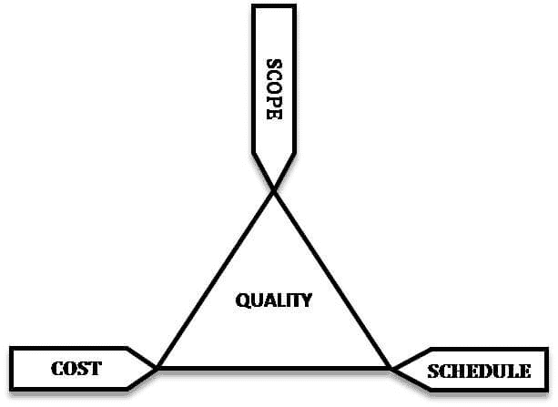
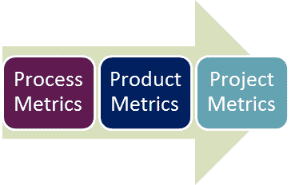
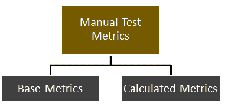

# 软件测试指标：什么是类型&示例

> 原文： [https://www.guru99.com/software-testing-metrics-complete-tutorial.html](https://www.guru99.com/software-testing-metrics-complete-tutorial.html)

## 什么是软件测试指标？

软件测试指标定义为有助于评估软件测试工作的进度，质量和运行状况的定量度量。 **指标**定量定义**系统，系统组件或过程**具有给定属性的程度。

了解指标的理想示例是将汽车的每周行驶里程与制造商建议的理想里程进行比较。



软件测试指标-提高软件测试过程的效率和有效性。

软件测试指标或软件测试度量是对流程或产品某些属性的范围，容量，尺寸，数量或大小的定量指示。

**软件测试测量示例**：缺陷总数

在本教程中，您将学习-

*   [什么是软件测试指标？](#1)
*   [为什么测试指标很重要？](#2)
*   [测试指标的类型](#3)
*   [手动测试指标](#4)
*   [测试指标生命周期](#5)
*   [如何计算测试指标](#6)
*   [测试指标](#7)的示例
*   [测试指标词汇表](#8)

## 为什么测试指标很重要？

```
"We cannot improve what we cannot measure" and Test Metrics helps us to do exactly the same.
```

*   决定下一阶段的活动
*   索赔或预测的证据
*   了解所需的改进类型
*   做出决定或流程或技术变更

阅读有关其[测试指标重要性的更多信息](/how-you-can-achieve-project-goals-through-test-monitoring-control.html)

## 测试指标的类型



*   **流程指标：**可用于提高 SDLC（软件开发生命周期）的流程效率
*   **产品指标：**它处理软件产品的质量
*   **项目指标：**可用于衡量项目团队或团队成员使用的任何测试工具的效率

确定正确的测试指标非常重要。 在确定测试指标之前，无需考虑几件事

*   确定指标准备的目标受众
*   定义指标目标
*   根据项目需求介绍所有相关指标
*   分析每个指标的成本效益方面以及项目带来最大产出的生活方式阶段

## 手动测试指标

在软件工程中，手动测试指标分为两类

*   **基本指标**
*   **计算指标**



基本指标是测试分析师在测试用例开发和执行期间收集的原始数据（**已执行的测试用例数量，测试用例的数量**）。 而计算的指标则来自基本指标中收集的数据。 为了进行测试报告，测试经理通常会遵循计算得出的指标（**完成百分比，测试覆盖率**）。

根据项目或业务模型，一些重要指标是

*   测试用例执行效率指标
*   测试用例准备生产力指标
*   缺陷指标
*   优先缺陷
*   严重程度缺陷
*   缺陷滑移率

## 测试指标生命周期

| 

**指标生命周期的不同阶段**

 | 

**每个阶段的步骤**

 |
| 

*   分析

 | 

*   指标的标识
*   定义已标识的质量检查指标

 |
| 

*   交流

 | 

*   向利益相关者和测试团队说明度量标准的需求
*   教育测试团队有关处理度量标准需要捕获的数据点

 |
| 

*   评估

 | 

*   捕获并验证数据
*   使用捕获的数据计算指标值

 |
| 

*   报告

 | 

*   制定具有有效结论的报告
*   将报告分发给利益相关者和各自的代表
*   征询利益相关者的反馈

 |

## 如何计算测试指标

| **Sr＃** | **测试指标**的步骤 | **范例** |
| 1 | 确定要衡量的关键软件测试过程 | 

*   测试进度跟踪过程

 |
| 2 | 在此步骤中，测试人员将数据用作基准来定义指标 | 

*   每天计划执行的测试用例数

 |
| 3 | 确定要遵循的信息，跟踪的频率和负责人 | 

*   每天的实际测试执行将在一天结束时由测试经理捕获。

 |
| 4 | 有效地计算，管理和解释已定义的指标 | 

*   每天执行的实际测试用例

 |
| 5 | 根据定义的指标来确定需要改进的地方 | 

*   [测试用例](/test-case.html) 的执行低于目标设置，我们需要调查原因并提出改进措施

 |

## 测试指标示例

为了了解如何计算测试指标，我们将看到一个执行百分比测试用例的示例。

为了获得百分比的测试用例的执行状态，我们使用公式。

```
Percentage test cases executed= (No of test cases executed/ Total no of test cases written) X 100
```

同样，您可以计算其他参数，例如**测试用例未执行，测试用例通过，测试用例失败，测试用例阻塞等。**

## 测试指标词汇

*   **返工率=** （该阶段花费的实际返工量/该阶段花费的实际总工时）X 100
*   **需求蠕变=** （添加的需求总数/初始需求数量）X100
*   **进度差异=** （实际工作量–​​估计工作量）/估计工作量）X 100
*   **发现测试缺陷的成本=** （花费在测试上的总精力/测试中发现的缺陷）
*   **计划延误=** （实际结束日期–预计结束日期）/（计划结束日期–计划开始日期）X 100
*   P **评估的测试用例百分比** =（通过的测试数量/执行的测试总数）X 100
*   **失败的测试用例百分比** =（失败的测试数量/执行的测试总数）X 100
*   **阻塞的测试用例百分比** =（阻塞的测试数/已执行的测试总数）X 100
*   **固定缺陷百分比** =（固定缺陷/报告的缺陷）X 100
*   **接受的缺陷百分比** =（开发团队接受为有效的缺陷/报告的缺陷总数）X 100
*   **缺陷延迟百分比** =（推迟发布的缺陷/报告的缺陷总数）X 100
*   **严重缺陷百分比** =（严重缺陷/报告的总缺陷数）X 100
*   **开发团队修复缺陷的平均时间** =（错误修复总时间/错误数量）
*   **每个时间段运行的测试数** =运行的测试数/总时间
*   **测试设计效率** =设计的测试次数/总时间
*   **测试审核效率** =审核的测试次数/总时间
*   **Bug 查找死记或每测试小时的缺陷数** =缺陷总数/测试小时总数