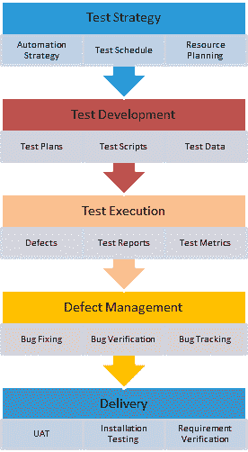

# 如何创建测试策略文档（示例模板）

> 原文： [https://www.guru99.com/how-to-create-test-strategy-document.html](https://www.guru99.com/how-to-create-test-strategy-document.html)

## 什么是测试策略？

**测试策略**是用于定义软件测试生命周期（STLC）方法的计划。 它指导质量检查小组定义[测试覆盖率](/test-coverage-in-software-testing.html)和测试范围。 它也可以帮助测试人员随时清楚地了解该项目。 当制定了适当的测试策略时，错过任何测试活动的可能性非常低。

测试策略文档回答了诸如您要完成的工作以及如何完成它的问题。 对于任何质量检查团队来说，这是最重要的文档。 编写有效的策略文档是测试人员根据经验开发的技能。 测试策略计划应与整个团队沟通，以使团队在方法和责任上保持一致。

## 测试计划与测试策略

关于[测试计划和测试策略](/test-plan-v-s-test-strategy.html)文档存在很大的困惑。 不同的组织具有独特的流程和标准来管理这些文档。 例如，某些组织将测试策略事实包含在[测试计划](/what-everybody-ought-to-know-about-test-planing.html)本身中，而某些组织将策略作为测试计划中的子部分。

| **测试计划** | **测试策略** |
| 

*   在测试计划中，定义了测试重点和​​项目范围。 它涉及测试范围，日程安排，要测试的功能，要测试的功能，估计和资源管理。

 | 

*   测试策略是达到测试目标和执行测试计划中提到的测试类型所遵循的指南。 它涉及测试目标，测试环境，测试方法，自动化工具和策略，应急计划以及风险分析

 |

为了更清楚**（如果测试计划是某个目标），则质量检查测试策略是到达该目标的地图。**

## 如何准备好的测试策略文件

每个组织都有其独特的优先级和一组软件设计规则，因此请勿盲目复制任何组织。 在遵循模板之前，请始终确保他们的文档兼容并为您的软件开发增加价值。

STLC 中的**测试策略：**

**步骤＃1：范围**

它定义了像

*   谁来审查文件？
*   谁将批准此文件？
*   按时进行的软件测试活动

**步骤＃2 测试方法**

它定义

*   测试过程
*   测试水平
*   每个团队成员的角色和职责
*   测试类型（负载测试，安全性测试，Performace 测试等）
*   测试方法&自动化工具（如果适用）
*   添加新缺陷，重新测试，[缺陷](/defect-management-process.html)分流，[回归测试](/regression-testing.html)和测试签名

**步骤＃3 测试环境**

*   定义每个环境的需求数量和所需的设置
*   定义测试数据的备份和还原策略

**步骤＃4 测试工具**

*   测试执行所需的自动化和测试管理工具
*   找出所需的许多开源和商业工具，并确定支持多少用户并做出相应计划

**步骤＃5 释放控制**

*   具有适当版本历史记录的发布管理计划，可确保对该版本中的所有修改执行测试

**步骤＃6 风险分析**

*   列出您可以估计的所有风险
*   制定明确的计划以减轻风险，同时也制定应急计划

**步骤＃7 审核和批准**

*   所有这些活动均由业务团队，项目管理，开发团队等进行审核并签字。
*   审查变更摘要应在文档开头以及批准的日期，名称和评论中进行追溯。

## 下载测试策略模板

点击下面下载示例测试策略文档

[下载测试策略模板](https://drive.google.com/uc?export=download&id=1q_bMaqb9M1DTboTDonIWhHll0LJL3mjB "Software Test Estimation Template")

**结论：**

在软件工程中，软件发布会不时地通过“测试策略”文档，以正确的方向绘制测试进度。 发布日期临近时，将跳过许多此类活动，因此，最好与团队成员讨论减少任何特定活动是否有助于发布而没有任何潜在风险。