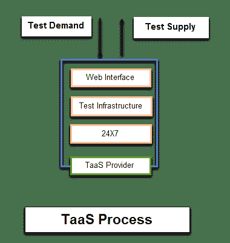
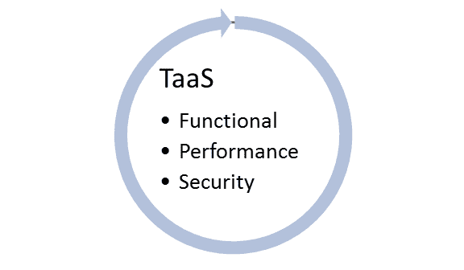
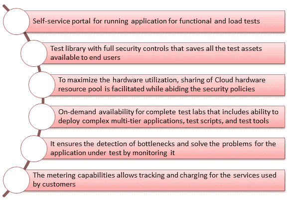

# 什么是测试即服务？ TaaS 模型解释

> 原文： [https://www.guru99.com/what-is-testing-as-a-service-taas.html](https://www.guru99.com/what-is-testing-as-a-service-taas.html)

## 什么是测试即服务（TaaS）？

**服务即测试（TaaS）**是一种外包模型，其中测试活动被外包给第三方，后者专门模拟真实的测试环境并查找软件产品中的错误。 在这里，测试是由第三方承包商而不是组织的员工完成的。

在以下情况下使用 TaaS：

*   公司缺乏在内部进行测试的技能或资源
*   不想内部开发人员影响测试过程的结果（如果在内部完成，他们可以这样做）
*   节省成本
*   提高测试执行速度并减少软件开发时间。

在本教程中，您将学习

*   [TaaS 的类型](#1)
*   [主要 TaaS 功能](#2)
*   [软件测试即服务通过云](#3)
*   [何时使用 TaaS](#4)
*   [云测试的好处](#5)
*   [传统服务与 TaaS 服务](#6)

## TaaS 的类型

*   **功能测试即服务：** TaaS [功能测试](/functional-testing.html)可能包括 UI / [GUI 测试](/gui-testing.html)，回归，集成和自动[用户接受测试](/user-acceptance-testing.html)（UAT），但不一定要进行功能测试
*   **性能测试即服务：**多个用户同时访问该应用程序。 通过创建虚拟用户并执行负载和压力测试，TaaS 可以模拟为真实的用户环境
*   **安全测试即服务：** TaaS 扫描应用程序和网站是否存在漏洞

## TaaS 的主要功能

## 通过云进行软件测试即服务

一旦创建了用户方案并设计了测试，这些服务提供商就会交付服务器以生成全球虚拟流量。

在 Cloud 中，软件测试按以下步骤进行

1.  开发用户方案
2.  设计测试用例
3.  精选的云服务提供商
4.  建立基础架构
5.  利用云服务
6.  开始测试
7.  监控目标
8.  交付

## 何时使用 TaaS

TaaS 在以下情况下很有用

*   对需要大量自动化且测试执行周期短的应用程序进行测试。
*   执行不需要深入了解设计或系统知识的测试任务
*   用于需要大量资源的临时或不定期测试活动。

## 云测试的好处

*   灵活的测试执行和测试资产
*   一些用户声称与传统的测试模型相比，云测试可节省 40-60％
*   通过消除在硬件采购，管理和维护，软件许可等之后进行的投资，从而获得快速的投资回报。
*   通过快速采购，项目设置和执行，可以更快地交付产品
*   确保数据完整性和随时随地可访问性
*   减少运营成本，维护成本和投资
*   使用时付款

## 传统服务与 TaaS 服务

| 方法 | 传统的 | 再次 |
| 测试环境 | 

*   手动创建的

 | 

*   点播

 |
| 测试资产 | 

*   手动生成的

 | 

*   动态

 |
| 测试数据 | 

*   手动生成

 | 

*   动态消毒的

 |
| 测试工具 | 

*   手动购买的

 | 

*   一经请求

 |
| 测试文件 | 

*   手动生成

 | 

*   动态生成的

 |
| 业务领域知识 | 

*   手动提取的

 | 

*   动态提取的

 |