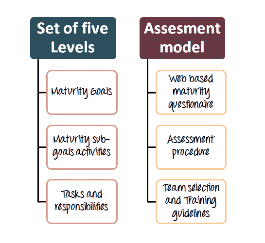

# 什么是软件测试中的测试成熟度模型（TMM）？

> 原文： [https://www.guru99.com/what-is-test-maturity-model-tmm.html](https://www.guru99.com/what-is-test-maturity-model-tmm.html)

TMM 基于能力成熟度模型（CMM），它最初由伊利诺伊理工学院开发。 TMM 的完整形式是测试成熟度模型。 它是用于测试过程改进的详细模型。 它可以与任何过程改进模型一起补充，也可以用作独立模型。

TMM 模型有两个主要部分

1.  一组定义测试功能的 5 个级别
2.  评估模型

## 不同级别的成熟度模型

TMM 的五个级别可帮助组织确定其过程的成熟度，并确定对于实现更高级别的测试成熟度必不可少的后续改进步骤。

| 

TMM 级别

 | 

目标

 | 

TMM 级别的目标

 |
| 级别 1：初始 | 软件应成功运行 | 

*   在此级别上，未确定任何过程领域。
*   测试的目的是确保软件运行正常。
*   该级别缺少资源，工具和训练有素的人员[
*   否 [在软件交付之前进行质量保证](/all-about-quality-assurance.html) 检查

 |
| 第 2 级：已定义 | 制定测试和调试目标和政策 | 

*   此级别区分测试和调试 & ，它们被认为是不同的活动。
*   编码
*   之后是测试阶段。测试的主要目标是证明软件符合规格

*   基本测试方法和技术到位

 |
| 第 3 级：集成 | 将测试集成到软件生命周期中 | 

*   测试已整合到整个生命周期中
*   根据需求定义了测试目标
*   存在测试组织
*   被视为专业活动的测试

 |
| 级别 4：管理和度量 | 建立测试测量程序 | 

*   测试是一个量化的过程
*   在所有开发阶段的评审均被视为测试
*   对于重用和 [回归测试](/regression-testing.html) ，已收集了测试用例 并记录在测试数据库中
*   记录缺陷并指定严重性级别

 |
| 第 5 级：优化 | 测试流程优化 | 

*   管理和定义测试
*   可以监控测试效率和成本
*   测试可以进行微调并不断改进
*   质量控制和 [实施缺陷](/defect-management-process.html) 预防
*   进行过程重用
*   与测试相关的指标也具有工具支持
*   工具为 [测试用例](/test-case.html) 设计提供支持 和缺陷收集

 |

## CMM & TMM 之间的区别

| 

坐标测量机

 | 

TMM

 |
| 

*   CMM 或能力成熟度模型用于判断组织

的软件过程的成熟度。 | 

*   TMM 或测试成熟度模型描述了测试过程，并且与监视软件测试模型

的质量有关。 |

## 结论：

在项目交付后发现缺陷时，软件维护既昂贵又耗时。 因此，尽管检测缺陷很重要，但在开发阶段使软件尽可能减少错误也很重要。 像 TMM 这样的标准测试过程可以帮助实现这一目标。 专为解决测试而设计的 TMM（测试成熟度模型）可以帮助组织提高其测试实践的成熟度。