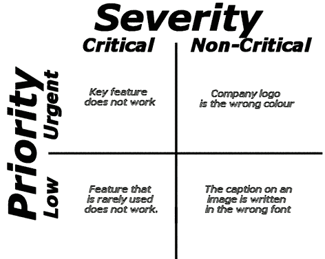
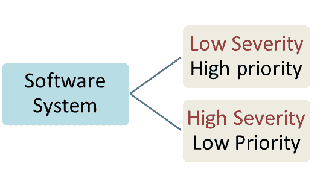
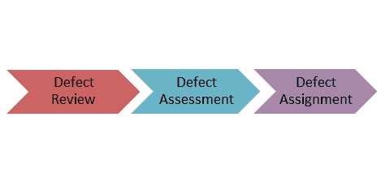

# 严重性&测试优先级：差异&示例

> 原文： [https://www.guru99.com/defect-severity-in-software-testing.html](https://www.guru99.com/defect-severity-in-software-testing.html)

## 严重性是什么？

严重性定义为[缺陷](/defect-management-process.html)对要测试的组件应用程序的开发或操作的影响程度。

对系统功能的更高影响将导致给漏洞分配更高的严重性。 [质量保证](/all-about-quality-assurance.html)工程师通常确定缺陷的严重程度

## 什么是优先级？

优先级定义为修复缺陷的顺序。 优先级越高，应该越早解决缺陷。

那些使软件系统无法使用的缺陷比那些导致软件小功能失效的缺陷具有更高的优先级。

## 缺陷严重性和优先级类型

*在软件测试中，缺陷严重度可以分为四类*

*   **严重**：此缺陷表示该过程已完全关闭，无法继续进行
*   **主要**：这是一个非常严重的缺陷，会使系统崩溃。 但是，系统的某些部分仍然可以运行
*   **中**：它会引起一些不良行为，但系统仍可运行
*   **低**：不会引起系统的重大故障

*缺陷优先级可以分为三类*

*   **低：**缺陷是刺激性的，但一旦修复了更严重的缺陷，就可以修复
*   **介质：**在正常的开发活动过程中，应解决缺陷。 它可以等到创建新版本
*   **高：**该缺陷必须尽快解决，因为它会严重影响系统，并且必须先修复后才能使用

## 确定缺陷严重性的提示

*   **决定出现的频率：**在某些情况下，如果在代码中频繁发生轻微缺陷，则情况可能更严重。 因此，从用户的角度来看，即使它是次要的缺陷，也更加严重。
*   **隔离缺陷：**隔离缺陷可以帮助找出其影响的严重性。

## 优先级与严重性：主要区别

<colgroup><col style="width: 312px;"><col style="width: 312px;"></colgroup>
| 

优先级

 | 

严重级别

 |
| 

*   缺陷优先级已定义了开发人员解决缺陷的顺序

 | 

*   缺陷严重度定义为缺陷对产品操作的影响程度

 |
| 

*   优先级分为三种类型：
    *   低
    *   中
    *   高

 | 严重性分为五种类型。 HTG13]化妆品 |
| 

*   优先级与调度相关联

 | 

*   严重程度与功能或标准相关联

 |
| 

*   优先级指示应尽快修复错误

 | 

*   严重性表示产品功能缺陷的严重性

 |
| 

*   与经理/客户协商确定缺陷的优先​​级

 | 

*   质量检查工程师确定缺陷的严重程度

 |
| 

*   优先级取决于业务价值

 | 

*   严重程度由功能

驱动 |
| 

*   其值是主观的，并且可以根据项目情况的变化而在一段时间内更改。

 | 

*   其值是客观的，不易更改

 |
| 

*   高优先级和低严重性状态指示，缺陷必须立即修复，但不影响应用程序

 | 

*   高严重性和低优先级状态指示必须修复缺陷，但不能基于即时基础

 |
| 

*   优先级状态基于客户要求

 | 

*   严重性状态基于产品

的技术方面 |
| 

*   在 UAT 期间，开发团队根据优先级

修复缺陷 | 

*   在 SIT 期间，开发团队将根据严重性并根据优先级修复缺陷

 |

## 缺陷严重性和优先级示例

让我们看一个低严重性和高优先级的示例，反之亦然

*   **严重性很低，具有较高的优先级：**任何货运网站的徽标错误，严重性都可能很低，因为它不会影响网站的功能，但是优先级却很高，因为您不会 希望任何进一步的运送使用错误的徽标。
*   **严重性很高而优先级较低：**同样，对于航班运营网站，预订功能上的缺陷可能具有很高的严重性，但由于可以按计划在发布时发布，因此它的优先级较低。 下一个周期。

## 缺陷分类

缺陷分类是一个尝试重新平衡流程的过程，其中测试团队面临资源有限的问题。 因此，当存在大量缺陷且测试人员数量有限，无法对其进行验证时，缺陷分类有助于根据缺陷参数（如严重性和优先级）尝试获取尽可能多的缺陷。

**如何确定缺陷分类：**

大多数系统使用优先级作为评估缺陷的主要标准。 但是，良好的分类流程也要考虑严重性。

分诊过程包括以下步骤

*   审查所有缺陷，包括团队拒绝的缺陷
*   缺陷的初始评估基于其内容以及相应的优先级和严重性设置
*   根据输入确定缺陷的优先​​级
*   分配缺陷以由产品经理正确发布
*   将缺陷重新定向到正确的所有者/团队以采取进一步措施

## 每个测试人员在选择严重性之前应考虑的准则

严重性参数由测试人员评估，而优先级参数由产品经理或分类小组评估。 为了确定缺陷的优先​​级，测试人员必须选择正确的严重性，以避免与开发团队混淆。

*   充分理解优先级和严重性的概念
*   始终根据问题类型分配严重性级别，因为这会影响其优先级
*   了解特定方案或[测试用例](/test-case.html)将如何影响最终用户
*   需要根据其复杂性和验证缺陷所需的时间来考虑修复缺陷所需的时间

## 结论：

*   在软件工程中，为缺陷分配错误的严重性可能会延迟 [STLC](/software-testing-life-cycle.html) 的过程，并且可能对团队的整体绩效产生重大影响。 因此，负责人需要准确，准确地确定缺陷。