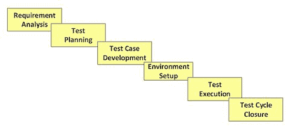

# STLC-软件测试生命周期阶段&进入，退出条件

> 原文： [https://www.guru99.com/software-testing-life-cycle.html](https://www.guru99.com/software-testing-life-cycle.html)

## 什么是软件测试生命周期（STLC）？

**软件测试生命周期（STLC）**是在测试过程中进行的一系列特定活动，以确保达到软件质量目标。 STLC 涉及验证和确认活动。 与流行的看法相反，软件测试不仅是一项单独的活动，即测试。 它包含一系列通过方法进行的活动，以帮助认证您的软件产品。 STLC 代表软件测试生命周期。

在本教程中，您将学习-

*   [STLC 模型](#1)的不同阶段
*   [需求分析](#2)
*   [测试计划](#3)
*   [测试用例开发](#4)
*   [测试环境设置](#5)
*   [测试执行](#6)
*   [测试周期关闭](#7)
*   [STLC 阶段以及进入和退出标准](#8)

## STLC 模型的不同阶段

<figure>

<figcaption style="display: table;">STLC Diagram</figcaption>

</figure>

以下是 STLC 的阶段：

*   需求分析
*   测试计划
*   测试案例开发
*   测试环境设置
*   测试执行
*   测试周期结束

每个阶段都有一个明确的进入和退出标准，即与活动&关联的可交付成果。

### 什么是出入境标准？

*   **进入标准：**进入标准提供了在开始测试之前必须完成的前提条件。
*   **退出标准：**退出标准定义了可以在完成测试之前必须完成的项目

您具有软件测试生命周期（STLC）中所有级别的进入和退出条件

在理想世界中，直到满足上一阶段的退出条件，您才可以进入下一阶段。 但是实际上这并不总是可能的。 因此，对于本教程，我们将重点关注 STLC 生命周期中不同阶段的活动和可交付成果。 让我们详细研究它们。

## 需求分析

在此阶段，测试团队从测试的角度研究需求，以识别可测试的需求。

质量保证团队可以与各种利益相关者（客户，业务分析师，技术主管，系统架构师等）进行互动，以详细了解需求。

需求可以是功能性的（定义软件必须执行的操作）或非功能性的（定义系统性能/安全可用性）

给定测试项目的自动化可行性也在此阶段完成。

**活动**

*   确定要执行的测试类型。
*   收集有关测试优先级和重点的详细信息。
*   准备[需求追踪矩阵（RTM）](/traceability-matrix.html)。
*   确定应该执行测试的测试环境详细信息。
*   自动化可行性分析（如果需要）。

**Deliverables**

*   RTM
*   自动化可行性报告。 （如果适用）

## 测试计划

通常，在此阶段，高级质量检查经理将确定项目的工作量和成本估算，并准备并最终确定测试计划。 在此阶段，还将确定测试策略。

**Activities**

*   准备用于各种类型测试的测试计划/策略文档
*   测试工具选择
*   测试工作量估算
*   资源计划以及确定角色和职责。
*   培训要求

**Deliverables**

*   [测试计划](/what-everybody-ought-to-know-about-test-planing.html) /策略文件。
*   [工作量估算](/an-expert-view-on-test-estimation.html)文档。

## 测试用例开发

此阶段涉及测试用例&测试脚本的创建，验证和返工。 [识别/创建测试数据](/software-testing-test-data.html)，并对其进行检查，然后进行重新处理。

**活动**

*   创建测试用例，自动化脚本（如果适用）
*   审查和基准测试用例和脚本
*   创建测试数据（如果“测试环境”可用）

**Deliverables**

*   测试用例/脚本
*   测试数据

## 测试环境设置

测试环境决定了测试工作产品的软件和硬件条件。 测试环境的设置是测试过程的关键方面之一， ***可以与测试用例开发阶段*** 同时进行。 如果客户/开发团队提供了测试环境，则 ***测试团队可能不会参与此活动*** ，在这种情况下，测试团队需要对测试/测试团队进行准备性检查（烟雾测试）。 给定的环境。

**Activities**

*   了解所需的体系结构，环境设置，并准备测试环境的硬件和软件要求列表。
*   设置测试环境和测试数据
*   在构建上执行烟雾测试

**Deliverables**

*   准备好环境并设置测试数据
*   烟雾测试结果。

## 测试执行

在此阶段，测试人员将根据测试计划和准备的测试用例进行测试。 错误将报告给开发团队以进行更正和重新测试。

**活动**

*   按照计划执行测试
*   记录测试结果，并记录失败案例的缺陷
*   将缺陷映射到 RTM 中的测试用例
*   重新测试[缺陷](/defect-management-process.html)修复
*   跟踪缺陷以解决问题

**Deliverables**

*   具有执行状态的已完成 RTM
*   测试用例更新结果
*   缺陷报告

## 测试周期结束

测试团队将开会，讨论和分析测试工件，以识别将来必须实施的策略，并从当前测试周期中吸取教训。 该想法是消除将来测试周期的过程瓶颈，并在将来共享任何类似项目的最佳实践。

**Activities**

*   根据时间，测试范围，成本，软件，关键业务目标，质量评估周期完成标准
*   根据上述参数准备测试指标。
*   记录项目中的学习情况
*   准备测试结束报告
*   向客户定性和定量报告工作产品的质量。
*   测试结果分析以按类型和严重性找出缺陷分布。

**Deliverables**

*   测试结束报告
*   测试指标

## STLC 阶段以及进入和退出条件

| **STLC 阶段** | **进入标准** | **活动** | **退出条件** | **可交付成果** |
| --- | --- | --- | --- | --- |
| 需求分析 | 

*   要求可用文件（功能和非功能性文件）
*   定义了接受标准。
*   应用程序体系结构文档可用。

 | 

*   分析业务功能以了解业务模块和特定于模块的功能。
*   标识模块中的所有事务。
*   标识所有用户配置文件。
*   收集用户界面/身份验证，地理分布要求。
*   标识要执行的测试类型。
*   收集有关测试优先级和重点的详细信息。
*   准备要求 [可追溯性矩阵](/traceability-matrix.html) （RTM）。
*   标识应该执行测试的测试环境详细信息。
*   自动化可行性分析（如果需要）。

 | 

*   已签署 RTM
*   客户已签署了测试自动化可行性报告

 | 

*   RTM
*   自动化可行性报告（如果适用）

 |
| 测试计划 | 

*   需求文档
*   需求追踪矩阵。
*   测试自动化可行性文件。

 | 

*   分析各种可用的测试方法
*   最终确定最合适的方法
*   准备用于各种类型测试的测试计划/策略文档
*   测试工具 选择
*   测试工作量估算
*   资源规划以及确定角色和职责。

 | 

*   批准的测试计划/策略文件。
*   工作量估算文档已签署。

 | 

*   测试计划/策略文件。
*   工作量估算文件。

 |
| 测试案例开发 | 

*   需求文档
*   RTM 和测试计划
*   自动化分析报告

 | 

*   创建测试用例，测试设计，自动化脚本（如适用）
*   复查基准测试用例和脚本并对其进行基准测试
*   创建测试数据

 | 

*   已审阅并签名的测试用例/脚本
*   已审阅并签名的测试数据

 | 

*   测试用例/脚本
*   测试数据

 |
| 测试环境设置 | 

*   提供系统设计和架构文档
*   提供环境设置计划

 | 

*   了解所需的体系结构，环境设置
*   准备硬件和软件开发要求列表
*   最终确定连接要求
*   准备环境设置清单
*   设置测试环境和测试数据
*   对建筑物进行烟雾测试
*   根据烟雾测试结果接受/拒绝建筑物

 | 

*   环境设置正在按计划和清单进行操作
*   测试数据设置完成
*   烟雾测试成功

 | 

*   已准备好环境，并设置了测试数据
*   烟雾测试结果。

 |
| 测试执行 | 

*   基准 RTM， [测试计划](/what-everybody-ought-to-know-about-test-planing.html) ，测试用例/脚本可用
*   测试环境已准备就绪
*   测试数据已建立

*   提供了要测试的构建的单元/集成测试报告

 | 

*   按计划执行测试
*   记录测试结果，并记录失败案例的缺陷
*   如有必要，更新测试计划/测试案例
*   地图缺陷 在 RTM 中测试案例
*   重新测试缺陷修复程序
*   [应用程序的回归测试](/regression-testing.html)
*   跟踪缺陷以解决

 | 

*   执行所有计划的测试
*   记录缺陷并跟踪缺陷以使其关闭

 | 

*   已完成 RTM，执行状态为
*   测试用例已更新为结果
*   缺陷报告

 |
| 测试周期结束 | 

*   测试已完成
*   提供了测试结果
*   有缺陷日志

 | 

*   根据-时间， [测试覆盖率](/test-coverage-in-software-testing.html) ，成本，软件质量，关键业务目标
*   根据上述参数评估周期完成标准。
*   记录项目中的学习情况
*   准备测试结束报告
*   向客户定性和定量报告工作产品的质量。
*   测试结果分析，以按类型和严重性找出缺陷分布

 | 客户签署的测试结束报告 | 

*   测试结束报告
*   测试指标

 |