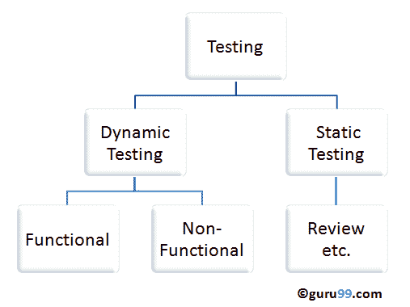
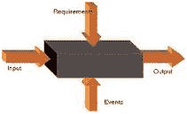
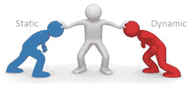

# 静态测试与动态测试：有什么区别？

> 原文： [https://www.guru99.com/static-dynamic-testing.html](https://www.guru99.com/static-dynamic-testing.html)

## 什么是静态测试？

在**静态测试**下，不执行代码。 而是手动检查代码，需求文档和设计文档以发现错误。 因此，名称为“静态”。

该测试的主要目的是通过在开发周期的早期阶段发现错误来提高软件产品的质量。 此测试也称为非执行技术或验证测试。

静态测试包括手动或自动检查文档。 这项检查是在测试的初始阶段完成的，以便在 STLC 早期发现[缺陷](/defect-management-process.html)。 它检查工作文件并提供评论意​​见

工作文件范例-

*   需求规格
*   设计文件
*   源代码
*   测试计划
*   测试用例
*   测试脚本
*   帮助或用户文档
*   网页内容

## 什么是动态测试？

在**动态测试**下，执行代码。 它检查软件系统的功能行为，内存/ CPU 使用率以及系统的整体性能。 因此，名称为“动态”

该测试的主要目的是确认软件产品符合业务需求。 此测试也称为执行技术或验证测试。

动态测试将执行该软件，并以预期结果验证输出。 动态测试在所有级别的测试中执行，可以是黑盒测试或白盒测试。

## 静态测试技术：

*   **非正式审阅：**这是一种审阅类型，它不遵循任何程序来查找文档中的错误。 使用这种技术，您只需查看文档并对其进行非正式评论。
*   **技术评论：**由您的同行组成的团队，审查软件产品的技术规格并检查其是否适合该项目。 他们试图找出所遵循的规范和标准中的任何差异。 这篇综述主要集中在与软件有关的技术文档上，例如测试策略，[测试计划](/what-everybody-ought-to-know-about-test-planing.html)和需求规范文档。
*   **演练：**工作产品的作者向其团队解释了该产品。 参与者可以提问。 作者*领导了一次会议。* 抄写员记下评论评论
*   **检查：**主要目的是查找缺陷，并由训练有素的主持人主持会议。 这种检查是一种形式的检查，它遵循严格的过程来查找缺陷。 审阅者有一份清单来审阅工作产品，他们记录缺陷并通知参与者纠正这些错误。
*   **静态代码审查：**这是对软件源代码的系统审查，无需执行代码。 它检查代码的语法，编码标准，代码优化等。这也称为白盒测试。可以在开发过程中的任何时候进行此检查。

## 动态测试技术：

*   **单元测试：**在“单元测试”下，开发人员对单个单元或模块进行了测试。 它涉及开发人员对源代码的测试。
*   **集成测试：**各个模块组合在一起并由开发人员进行测试。 目的是确定集成后哪些模块可以按预期工作。
*   **系统测试：** [系统测试](/system-testing.html)通过检查系统或应用程序是否满足要求规格文档而在整个系统上执行。

同样，非功能测试（例如性能，[安全测试](/what-is-security-testing.html)）也属于动态测试的类别。

## **静态测试和动态测试之间的区别：**

| 

**静态测试**

 | 

**动态测试**

 |
| 在不执行程序的情况下完成了测试 | 通过执行程序进行测试 |
| 此测试执行验证过程 | 动态测试执行验证过程 |
| 静态测试是关于预防缺陷 | 动态测试是关于发现并修复缺陷 |
| 静态测试可评估代码和文档 | 动态测试提供了软件系统中的错误/瓶颈。 |
| 静态测试涉及清单和要遵循的过程 | 动态测试涉及要执行的测试用例 |
| 可以在编译之前执行此测试 | 编译后执行动态测试 |
| 静态测试涵盖结构和声明覆盖率测试 | 动态测试技术是边值分析&等价分区。 |
| 发现缺陷和修复的成本更低 | 发现和修复缺陷的成本很高 |
| 由于此过程在早期阶段就涉及，因此投资回报率将很高 | 由于此过程涉及开发阶段，因此投资回报率将很低 |
| 强烈推荐更多评论以保证质量 | 强烈建议您提供更多缺陷，以保证高质量。 |
| 需要大量会议 | 相较之下，会议次数较少 |

## 关键区别

*   静态测试是在不执行程序的情况下完成的，而动态测试是在执行程序的情况下完成的。
*   静态测试检查代码，需求文档和设计文档以发现错误，而动态测试则检查软件系统的功能行为，内存/ CPU 使用率和系统的整体性能。
*   静态测试与缺陷的预防有关，而动态测试与发现和修复缺陷有关。
*   静态测试执行验证过程，而动态测试执行验证过程。
*   静态测试在编译之前执行，而动态测试在编译之后执行。
*   静态测试技术是结构和语句的覆盖范围，而动态测试技术是边值分析&等价性划分。