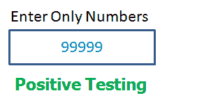
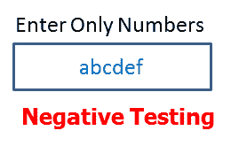
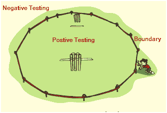
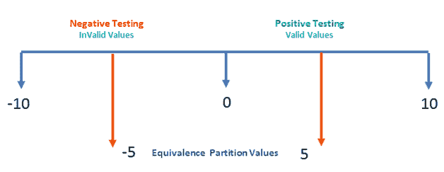

# 正测试和负测试的例子

> 原文： [https://www.guru99.com/positive-and-negative-testing.html](https://www.guru99.com/positive-and-negative-testing.html)

软件测试是验证和验证软件应用程序以检查其是否按预期运行的过程。 目的是发现缺陷并提高产品质量。 有两种测试软件的方法，即肯定测试和否定测试。

### 什么是正面测试？

**肯定测试**是通过提供**有效数据** **作为输入可以在系统上执行的测试类型。** 它检查应用程序在正输入下的行为是否符合预期。 进行此测试是为了检查应用程序应执行的工作。

例如 -

.png)

应用程序中有一个文本框，只能接受数字。 系统可接受的输入值最大为 99999，除此以外的任何其他值均不可接受。 要进行正面测试，请将有效输入值设置为 0 到 99999，然后检查系统是否接受这些值。

### 什么是阴性测试？

**负面测试**是可以通过提供**无效数据作为输入**在系统上执行的测试的变体。 它检查应用程序在负输入下的行为是否符合预期。 这是为了测试应用程序没有执行不应执行的任何操作。

For example -

.png)

负测试可以通过输入字符 A 到 Z 或从 a 到 z 来执行。 软件系统不应接受这些值，否则应针对这些无效的数据输入抛出错误消息。

在两个测试中，都需要考虑以下几点：

*   输入数据
*   需要执行的动作
*   输出结果

### 用于正面和负面测试的测试技术：

以下技术用于测试的正面和负面验证：

*   边值分析
*   等效分区

#### 边值分析：

这是一种软件测试技术，其中，测试用例被设计为在边界处包括值。 如果在边界值限制内使用输入数据，则称其为肯定测试。 如果输入数据超出边界值限制，则称其为负测试。

.png)

For example -

系统可以接受 0 到 10 之间的数字。 所有其他数字均为无效值。 在这种技术下，将测试边界值-1,0,1 和 9,10,11。

#### 等效分区：

这是一种软件测试技术，可将输入数据分为许多分区。 每个分区的值必须至少测试一次。 具有有效值的分区用于肯定测试。 而具有无效值的分区用于否定测试。

.png)

例如-

零到十的数值可以分为两个（或三个）分区。 在我们的情况下，我们有两个分区-10 至-1 和 0 至 10.可以从每个部分获取样本值（5 和-5）来测试场景。

**结论：**

测试有助于交付高质量的软件应用程序，并确保软件在启动之前没有错误。 为了进行有效的测试，请同时使用-正测试和负测试，它们对软件质量具有足够的信心。 实时用户可以输入任何值，这些值需要在发布之前进行测试。