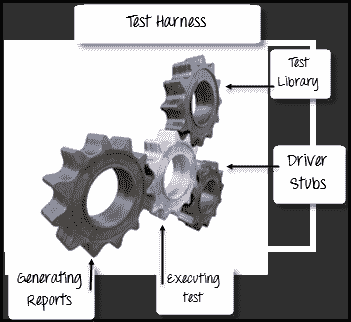

# 什么是测试线束？ 工具&的例子

> 原文： [https://www.guru99.com/what-is-test-harness-comparison.html](https://www.guru99.com/what-is-test-harness-comparison.html)

## 什么是测试线束？

**测试线束**是执行测试所需的存根，驱动程序和其他支持工具的集合。 测试工具通过使用测试库执行测试并生成报告。 测试工具包含编译和运行测试所需的所有信息，例如测试用例，目标部署端口（TDP），被测源文件，存根等。

## 为什么使用测试线束？

*   自动化测试过程
*   执行测试用例的测试套件
*   生成相关的测试报告
*   支持调试
*   记录每个测试的测试结果
*   帮助开发人员在代码级别衡量代码覆盖率
*   通过自动化提高系统的生产率
*   提高软件组件和应用程序的质量
*   处理测试人员难以模拟的复杂条件

## 在两种情况下使用测试线束

1.  **自动化测试：**它包含测试脚本，运行这些脚本并收集结果进行分析所必需的参数
2.  **集成测试：**用于将两个相互交互的代码或模块单元组合在一起，以检查组合行为是否符合预期

## 测试线束工具

*   [Junit](/junit-tutorial.html) ：使用 [Java](/java-tutorial.html) 时使用的工具
*   [Nunit：](https://nunit.org/)用于使用.Net 框架的工具

## 测试工具与测试框架

| 

测试线束

 | 

测试自动化框架

 |
| 

*   测试工具由驱动程序和存根组成，它们是与测试软件

交互的小型虚拟程序。 | 

*   这是一组流程，过程，抽象概念和设计和实现自动化测试的环境。

 |
| 

*   您无法在测试线束

中“记录&回放”脚本 | 

*   测试人员可以在此框架中手动“记录 & 回放”脚本

 |
| 

*   测试工具包含编译和运行测试所需的所有信息，例如测试用例，目标部署端口（TDP），被测源文件，存根等。

 | 

*   测试自动化框架包含诸如测试库，测试工具，自动化测试实践，测试平台等信息。

 |
| 

*   测试工具分类为
    *   [自动化测试](/automation-testing.html)
    *   [集成测试](/integration-testing.html)

 | 

*   [自动化框架](/test-automation-framework.html) 示例
    *   数据驱动测试
    *   关键字驱动测试
    *   模块化驱动测试
    *   混合测试
    *   基于模型的测试
    *   代码驱动的测试
    *   行为驱动的测试

 |