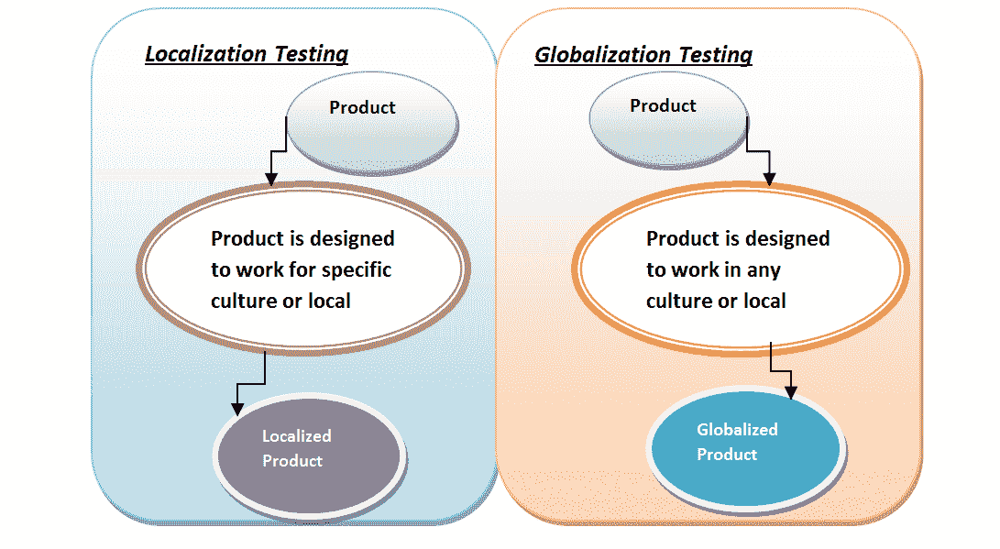

# 全球化测试和本地化测试之间的区别

> 原文： [https://www.guru99.com/globalization-vs-localization-testing.html](https://www.guru99.com/globalization-vs-localization-testing.html)

### 什么是本地化测试？

本地化测试是用于针对特定区域性或区域设置检查产品的本地化版本的软件测试过程。 受本地化测试影响的区域是 UI 和内容。

### 什么是全球化测试？

全球化测试是为了确保应用程序可以在任何文化或地区（语言，地区和代码页）中运行，也称为国际化测试。

## 关键区别

*   全球化着重于应用程序的全球功能，而本地化着重于给定文化或地区的一部分用户。
*   在全球化产品中，代码与消息或信息分开，而本地化产品则不需要
*   全球化可确保在不破坏功能的情况下，代码可以处理所有国际支持，而本地化可确保对语言准确性和资源属性的验证。
*   全球化可以检测应用程序中的潜在问题，而本地化可以验证所有应用程序资源。

## 全球化测试与本地化测试

| 

全球化测试

 | 

本地化测试

 |
| 

*   全球化测试使用所有可能的国际输入类型检查产品的正常功能。 它可确保在不破坏功能的情况下，代码可以处理所有国际支持。 例如，I18N 是规划和实施产品和服务的过程，以便可以轻松地将其适应特定的语言和文化。

 | 

*   进行了本地化测试，以确保针对特定目标或地区的产品质量。 例如，对于法国用户，测试产品表示为 L10N。

 |
| 

*   在全球化的产品中，代码与消息或信息分开。 借助全球化，它使软件可以使用不同的语言，而不必重新设计完整的软件。

 | 

*   对于本地产品

，这不是必需的 |
| 

*   全球化将应用程序的功能集中在作为通用用户群的用户身上。

 | 

*   本地化着眼于给定文化或地区中的一部分用户。

 |
| 

*   将测试人员与翻译人员和工程师分开，以确保采取彻底而公正的方法。

 | 

*   由于仅在语言环境

中完成，因此有助于减少测试时间 |
| 

*   正式的错误报告

 | 

*   降低了总体测试和支持成本

 |
| 

*   检测应用程序设计中可能抑制全球化的潜在问题

 | 

*   验证所有应用程序资源

 |
| 

*   它确保在不中断功能的情况下，代码可以处理所有国际支持

 | 

*   验证语言准确性和资源属性。 检查印刷错误

 |
| 

*   语言准确性和资源属性的验证

 | 

*   打印文档，消息，命令键序列等的一致性检查。

 |
| 

*   根据产品的目标区域进行硬件和应用程序的兼容性测试

 | 

*   确认输入和显示环境标准，并遵守系统。 用户界面

的可用性 |