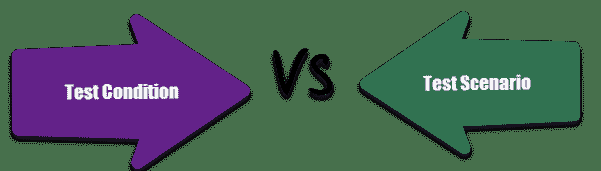

# 测试条件与测试场景：有什么区别？

> 原文： [https://www.guru99.com/test-scenario-vs-test-condition.html](https://www.guru99.com/test-scenario-vs-test-condition.html)

### 什么是测试方案？

[测试场景](/test-scenario.html)是测试应用程序的可能方法或方法。

### 什么是测试条件？

测试条件是测试人员测试应用程序必须遵循的规范。 一个测试方案中可以有多个测试条件。

测试方案和测试条件之间的差异是质量检查初学者中非常常见的常见问题。

以下是详细的比较 

| 

测试场景

 | 

测试条件

 |
| 

*   测试方案是测试应用程序的一种可能方法。

 | 

*   测试条件是测试应用程序应遵循的约束。

 |
| 

*   测试场景可以是单个或一组测试用例

 | 

*   测试条件可以是一项功能，也可以是您要验证的任何内容。 简单来说，测试用例的目标

 |
| 

*   当时间较短且大多数团队成员都了解一种生产线方案的细节时，这一点很重要

 | 

*   它是系统的一项或一项，可以通过一个或多个测试用例进行验证。 例如; 交易，功能，结构要素等。

 |
| 

*   良好 [可通过在测试方案中划分应用程序来实现测试覆盖率](/test-coverage-in-software-testing.html) ，从而降低了复杂性

 | 

*   良好的测试条件，确保系统没有错误

 |
| 

*   测试场景相当模糊，涵盖了广泛的可能性

 | 

*   测试条件非常具体

 |
| **示例：**对于测试，您有很多方法，例如肯定测试，否定测试，BVA 等。 | **示例：**当用户名和密码有效时，应用程序将前进 |